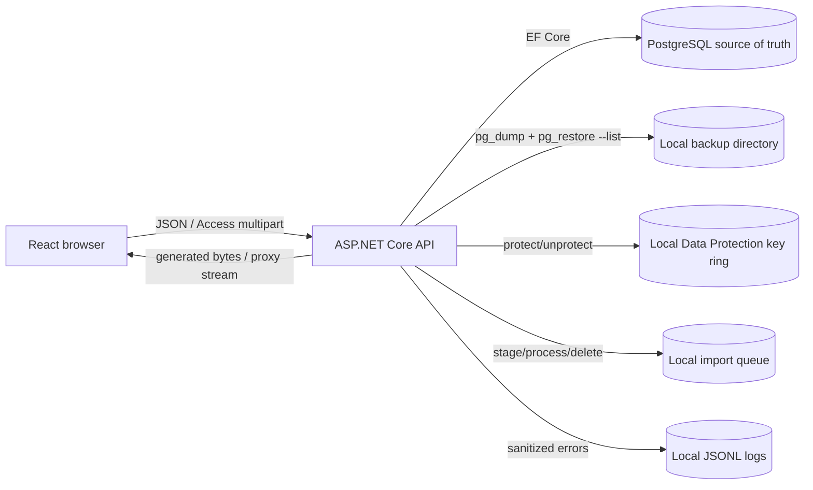
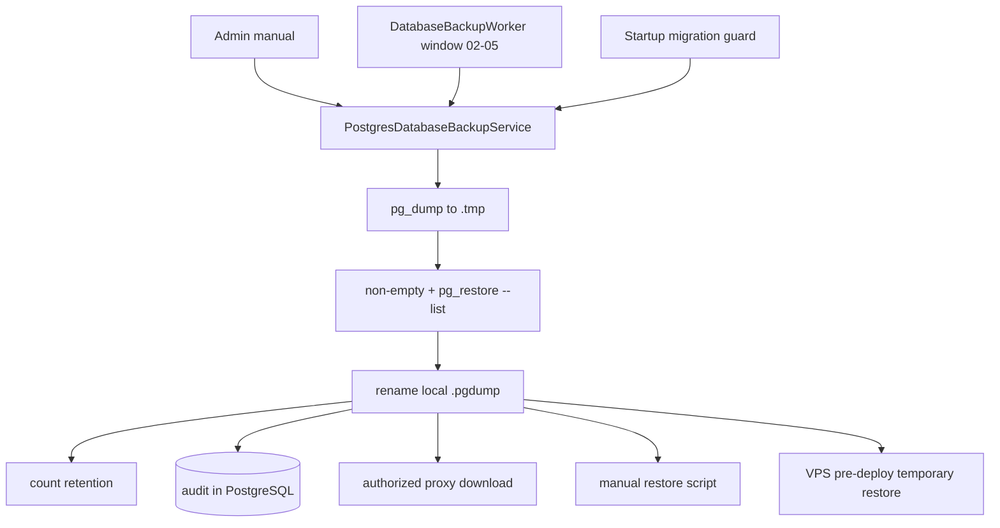
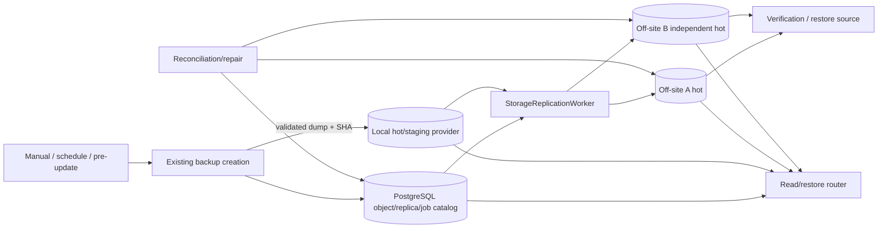
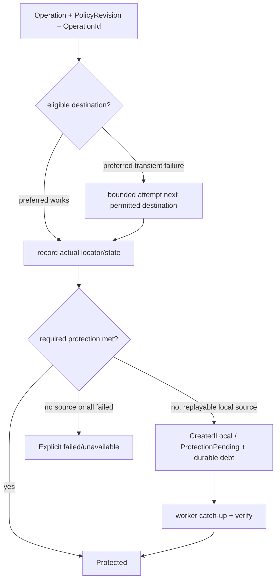

# Полный аудит storage, backup/restore и отказоустойчивости

Дата: 22.09.2026  
Ревизия: 1.0  
Baseline: `master` / `e5309e8ae851d6a5f4ce4960e01066ded651e8fb`  
Режим: `ANALYZE_AND_PLAN_ONLY`

## 1. Executive Summary

GarageBalance в текущем baseline не использует S3, S3-compatible или облачные диски. PostgreSQL является source of truth для финансовых и персональных данных; локальная файловая система используется для `.pgdump`, Data Protection key ring, временных Access-файлов и диагностических JSONL. Постоянных пользовательских вложений/медиа нет (`EVID-002`, `EVID-003`).

Локальный DB backup реализован лучше простой команды: `pg_dump` пишет `.tmp`, сервис проверяет размер и `pg_restore --list`, затем делает rename; доступны ручной/автоматический/pre-update режимы, count-retention, audit, proxy download с Range и guarded restore scripts (`EVID-004..015`, `EVID-023`, `EVID-024`). Но это не независимый DR backup: DB, dumps, key ring и config могут находиться на одном host; checksum, off-site replicas, durable copy states, automated repair и регулярный полный restore отсутствуют. Потеря host/disk — `RISK-001 CRITICAL`.

Минимально достаточная цель — не «S3 для всего», а backward-compatible storage subsystem для критичных backup artifacts: local staging/quick copy + два независимых off-site S3-compatible destinations, DB catalog logical objects/replicas/jobs, per-copy verification, async delivery, automatic destination fallback, version-aware read/restore selection, catch-up/reconciliation и проверяемый restore. Current reports, import staging и logs не переносятся без отдельного требования (`DEC-001`).

Текущая система не может обещать write/read failover для объекта, существующего только на недоступном диске. Целевая система сможет переключаться только на разрешённый destination, который фактически содержит нужную verified generation; required copies не понижаются молча. Реализация в этом запуске не выполнялась.

## 2. Repository/Service Map, baseline и границы

| Область | Фактическая роль | Storage relevance | Evidence |
|---|---|---|---|
| `backend/GarageBalance.Api` | ASP.NET Core API, EF Core, hosted workers | DB backup, import staging, keys, logs, exports | `EVID-001`, `EVID-005` |
| `backend/GarageBalance.Api.Tests` | unit/integration/architecture/deployment tests | Backup/import/log/privacy baseline | `EVID-029` |
| `backend/GarageBalance.PerformanceSeed`, `ShowcaseSeed` | Test/demo data tools | PostgreSQL writes only | `EVID-001` |
| `frontend` | React/Vite UI | Backup admin UI and downloads | `EVID-013` |
| `infrastructure/scripts` | Backup, restore, deploy, diagnostics | Local/VPS operational backup and restore | `EVID-023..025` |
| `docker-compose.yml`, `distribution/docker` | Local distribution | Bind mounts/volumes for DB, backups, keys, logs, import | `EVID-016` |
| `.github/workflows` | CI/release/deploy | Verification/artifact retention; not business-data backup | repository inspection |

Изучены manifests, code, migrations/model snapshot, tests, configuration, Docker, GitHub Actions, systemd/nginx/logrotate, PowerShell/bash, docs и Git history. Исключены из бессистемного чтения `bin/`, `obj/`, `node_modules/`, compiled/binary artifacts; их manifests и integration points проверены. Production/VPS, реальные provider accounts, provider pricing/capabilities и managed snapshots не исследовались: `NOT VERIFIED`.

Исходный dirty state до шести новых отчётов: только untracked `docs/storage-backup-multistorage-audit-2026-09-22.md`. Он существовал в baseline текущего запроса и не изменялся.

## 3. Data Classification Matrix

| Data Class | Producer/Consumer | Source of Truth | Criticality / PII | Size/Pattern | Current Location | Replica / Backup / Retention | RPO/RTO | Restore | Evidence |
|---|---|---|---|---|---|---|---|---|---|
| PostgreSQL business data | EF repositories/services; API/UI | PostgreSQL | `CRITICAL`; financial, personal | Growth `NOT VERIFIED`; frequent OLTP | PostgreSQL volume/system DB | Local `.pgdump`; no independent replica | Current RPO operationally `NOT VERIFIED`; proposed ≤4h/≤4h | `pg_restore`, app verification incomplete | `EVID-003`, `EVID-006`, `EVID-030` |
| DB `.pgdump` | Backup service/worker/scripts; admin/restore | File is a recovery point; catalog currently filename-only | `CRITICAL`; contains PII/finance | Sequential write, rare read; observed ~216–219 KiB is non-representative | Local backup directory/bind mount | count 30; no checksum/off-site/immutability | Proposed protection lag ≤15 min, restore ≤4h | Proxy download/manual or VPS temp restore | `EVID-004..015`, `EVID-023..024` |
| Data Protection key ring | ASP.NET Core Data Protection | Key files | `HIGH`; cryptographic material | Small, changes on rotation | Local path/volume | Manual guidance only | Proposed RPO after every change, ≤24h | Restore exact protected key set | `EVID-017`, `EVID-032` |
| Deployment config/secret references | Operator/systemd/Docker | External config/secret source | `HIGH`; secrets | Small, rare writes | `.env` or systemd env, outside Git | Manual guidance only | Proposed RPO after change | Recreate securely, no plaintext manifest | `EVID-016`, `EVID-032` |
| Raw Access dry-run | Import endpoint/worker | Temporary bytes; DB run metadata is workflow truth | `HIGH privacy`; PII likely | ≤50 MiB, write once/read once | local `import-queue/<runId>.pending` | No backup required; delete after processing; no orphan TTL | RPO N/A; cleanup objective proposed 24h quarantine | Re-upload source if needed | `EVID-018` |
| Import report/quarantine metadata | Import service/UI | PostgreSQL | `HIGH`; imported data | JSON/rows, bounded by import | PostgreSQL | Included in DB dump | Same as DB | DB restore | import code/migrations |
| Generated XLSX/PDF/CSV/JSON | Report/audit services; browser | Re-creatable from DB | `MEDIUM`; may contain PII | on-demand, memory-backed | transient process/browser | No backup; browser lifecycle | N/A | Regenerate | `EVID-020` |
| Diagnostic JSONL | Logger/admin diagnostics | Local logs, not business truth | `LOW/MEDIUM`; sanitized but sensitive diagnostics possible | error-only; 10 MiB/file | local `/logs` | 14-day retention; no off-site | N/A | Not required for business recovery | `EVID-019` |
| Diagnostic ZIP | Diagnostics service/admin | Derived | `LOW/MEDIUM` | ≤20 MiB configured | memory only | none | N/A | regenerate | `EVID-019` |
| Release catalog JSON | release package/synchronizer | Git/release source + DB projection | `LOW` | small/read-mostly | app package and PostgreSQL | Git/release reproducible | source-control RPO/RTO | redeploy/sync | `EVID-021` |
| Frontend/backend artifacts | CI/release/operator | Git/tag/release | `LOW`; no business data | immutable releases | GitHub/release/VPS dirs | provider artifact retention | N/A | rebuild/redeploy | repository inspection |
| nginx/system logs | OS services | local logs | `LOW/MEDIUM` | append/rotate | VPS filesystem/journald | local rotation | N/A | not required | deployment configs |

Not found and therefore `NOT REQUIRED` now: persistent avatars/images/video/audio/mail attachments/native cloud documents, Redis/SQLite production persistence, CDN objects, ML artifacts. Future addition requires a new data-class policy rather than silently reusing backup policy.

## 4. Storage Provider Matrix

Здесь `provider` означает фактически используемое физическое назначение, даже если current code не имеет provider abstraction.

| Connection/Destination ID | Backend/Adapter | Locator / role | R/W/D | Credentials | Failure Domain | Actual Usage | Evidence |
|---|---|---|---|---|---|---|---|
| `postgres-primary` | PostgreSQL/Npgsql/EF Core | connection string; business source | R/W/domain delete | env/config | DB host/volume/account | All business metadata | `EVID-003` |
| `local-backup-dir` | `System.IO` + `pg_dump/pg_restore` | absolute directory + managed filename; hot backup/staging | R/W/delete | OS ACL + DB credentials for dump | Application host/disk | Active DB backups | `EVID-004..011`, `EVID-016` |
| `data-protection-keyring` | ASP.NET Data Protection filesystem | configured directory/volume | framework R/W | OS ACL | Application host/disk | Encryption keys | `EVID-017` |
| `local-import-queue` | `System.IO` | `<runId>.pending`; temporary | R/W/delete | OS ACL + app permission | Application host/disk | Access dry-run staging | `EVID-018` |
| `local-diagnostic-logs` | `System.IO` | JSONL path; operational logs | R/W/delete by retention | OS ACL | Application host/disk | Error diagnostics | `EVID-019` |
| `s3-*` / cloud disks | None | None | `NOT IMPLEMENTED` | None | None | No actual usage | `EVID-002`, `EVID-034` |

Два alias/mount одного physical host не должны считаться независимыми copies. Independence target требует минимум разных failure domains; точный provider/account/region — внешний gate.

## 5. Current Runtime Storage Architecture

There is no current runtime file-upload object catalog. Access upload is a bounded temporary workflow, not permanent document storage. The business integrations 1C Fresh and receipt printing are HTTP adapters and remain outside storage routing (`EVID-027`).

## 6. Current Backup/Restore Architecture

### Verified strengths

- Incomplete dump is not published as final filename.
- Managed names and path traversal are constrained.
- Password is not placed in command-line args.
- Manual operations are authorized/audited; download supports Range.
- Pre-migration backup blocks migration when creation fails.
- VPS script contains a real disposable-DB restore check.

### Gaps

- No off-site destination or automatic backup-delivery fallback.
- No SHA-256/manifest or independent catalog.
- No durable per-destination state, retry, UNKNOWN reconciliation or repair.
- No scheduled full restore + key/config + application smoke.
- Freshness is neither readiness nor alert signal.
- Physical delete precedes durable audit/replica workflow.

## 7. Storage Policy Matrix

| Data Class | Runtime Pool | Write / ACK policy | Read policy | Required / desired copies | Backup/Tier | Integrity | Direct/Proxy | Decision |
|---|---|---|---|---|---|---|---|---|
| DB business rows | PostgreSQL | DB transaction | PostgreSQL only | DB HA outside current scope | logical dump | DB constraints + dump verify | API JSON | Keep source of truth (`DEC-001`) |
| DB backup artifacts | `DatabaseBackupsPool` | local verified creation returns `created_local`; async remote protection tracked separately | current verified replica, local preferred, then permitted remote | `PROPOSED`: required 2 independent total incl. ≥1 off-site; desired 3 total | local hot + remote hot; cold only after RTO gate | size + SHA-256 + manifest; scheduled full hash/restore | proxy default; short direct GET only if provider safely supports it | `DEC-002..005` |
| Key/config recovery bundle | `RecoverySecretsPool` distinct from runtime | encrypted bundle only; no plaintext success | operator/restore tool only | `PROPOSED`: 2 independent encrypted copies; key stored separately | hot protected; archive only after key/RTO check | authenticated encryption + inventory | no user direct URL | `DEC-008` |
| Access pending | local temp pool | one bounded local staging file; enqueue DB row | worker by run ID | 1 temporary copy | no backup; TTL/quarantine | size, extension, import SHA | proxy upload only | Keep isolated (`DEC-001`) |
| Generated exports | none | generated response | same response | 0 persistent | no backup | business/report tests | proxy response | `NOT REQUIRED` |
| Diagnostic logs | local diagnostics | best-effort local | admin package | 1 local | optional centralized logging deferred | sanitizer/retention | proxy ZIP | `DEFERRED` |

## 8. Backup Tier Matrix

| Backup Type | Source | Hot Copy | Independent Copy | Warm/Cold/Archive | Retention | RTO | Verification | Restore Test |
|---|---|---|---|---|---|---|---|---|
| Current DB dump | PostgreSQL | local directory | none | none | last 30 files | `NOT VERIFIED` | non-empty + TOC | VPS pre-deploy only; regular `NOT VERIFIED` |
| Target recent DB backup | PostgreSQL | local + provider A standard | provider B standard | none initially | `PROPOSED`: 48 four-hourly + 30 daily | ≤4h proposed | SHA/size + provider metadata | weekly disposable DB/app smoke |
| Target long-term DB backup | verified recent backup | latest hot set remains | independent provider | provider-specific cold/archive only after official capability/cost/RTO check | `PROPOSED`: 12 monthly | ≤8h proposed; provider gate | manifest/full hash before transition | periodic retrieval+restore sample |
| Key/config recovery bundle | keys + secret references/config inventory | encrypted provider A | encrypted provider B/account | archive optional | after every change + rotation policy | ≤8h proposed | AEAD/checksum/key availability | decrypt in isolated DR drill |

No provider/tier is selected. Retrieval delay, minimum duration, Object Lock and cost are `NOT VERIFIED`, not claimed capabilities.

## 9. Multi-storage capability and failover coverage

### Current

- Simultaneous copies: `NOT IMPLEMENTED`.
- Read failover: `NOT IMPLEMENTED`.
- New-write destination failover: `NOT IMPLEMENTED`.
- Backup upload fallback: `NOT IMPLEMENTED`.
- Replica catalog/repair/failback: `NOT IMPLEMENTED`.
- Single-local compatibility: `IMPLEMENTED`, verified by code/tests.

### Target boundary

Read/write/backup failover is scoped to managed backup artifacts because there are no persistent runtime user files. A failed upload to provider A proceeds to permitted B without waiting forever for A; each copy has its own durable state. A backup creation source failure (`pg_dump`, local staging, DB/catalog/KMS) cannot be converted into success by changing destination. An existing artifact is readable only from a replica with matching logical object/generation/checksum. If no such copy exists, return an explicit error; never old/empty bytes with 200.

## 10. Data Integrity and Reconciliation

Current integrity is partial: dump size + TOC, Access SHA in import flow, package/release hashes in deployment paths. DB backup has no stored strong checksum. ETag must never be treated as universal MD5.

Target reconciliation (`DEC-004`) uses PostgreSQL expected inventory plus sidecar manifests outside production DB:

1. select objects due for sampled/full scan;
2. compare expected replica locator, generation, size and SHA metadata;
3. full-stream SHA only on schedule/suspicion to control egress;
4. classify `Missing`, `Corrupted`, `Stale`, `Unknown`, provider outage separately;
5. select a verified authoritative replica;
6. create idempotent repair job for only missing/bad destination;
7. verify repaired bytes and update debt;
8. quarantine mass-corruption/compromise instead of propagating it.

DB-row-without-file and file-without-row are handled by inventory/reconciliation. Deterministic object key plus logical `OperationId` prevents blind duplicate publication after unknown response.

## 11. Upload/Download Architecture

### Current upload

Only Access multipart upload exists; it streams with 64 KiB buffer to bounded local staging, validates extension/size, creates DB run metadata, then worker deletes it (`EVID-018`). It is not a permanent storage API.

### Current download

Backup is streamed through authorized backend and supports Range (`EVID-011`). Reports/exports are generated in memory.

### Target

- DB backup upload remains server-side proxy/worker streaming from a replayable local artifact; multipart/provider-native resumable support is used only above a measured threshold.
- Remote direct upload from browser is `NOT REQUIRED` for DB backups.
- Backup download keeps stable authorized API endpoint. API may proxy a verified replica or issue a ≤5-minute provider-native signed GET after permission checks.
- If direct URL A fails, client retries the logical endpoint for a new B URL/proxy; an issued URL cannot be magically redirected.
- Proxy can fail over only before response bytes. Mid-stream recovery requires same generation, verified identical bytes and Range offset; otherwise explicit restart/error.
- No long-lived credentials/refresh tokens reach frontend.

## 12. Delete, Retention and Immutability

Current delete and retention are immediate physical filesystem deletion (`EVID-009`); no tombstone/versioning/WORM exists. Target sequence:

`logical tombstone -> durable per-replica deletion jobs -> retry only failures -> keep independent backup until retention permits -> final metadata state`.

Late upload/repair must compare generation/tombstone and cannot resurrect deleted content. Provider lifecycle is enabled only after proving it cannot remove a still-needed restore chain. Object Lock/WORM is optional and provider-gated; irreversible retention requires explicit owner approval.

## 13. Backup Analysis

| Property | Current fact | Status |
|---|---|---|
| Source | PostgreSQL | `IMPLEMENTED / CODE VERIFIED` |
| Creation | custom-format `pg_dump` | `IMPLEMENTED / TEST VERIFIED` |
| Scheduler | API worker/window; optional Windows task/scripts | `PARTIAL / OPERATION NOT VERIFIED` |
| Staging | local `.tmp` then rename | `IMPLEMENTED / TEST VERIFIED` |
| Compression | PostgreSQL custom format | `IMPLEMENTED` |
| Encryption | no application-level encryption | `NOT IMPLEMENTED` |
| Destination | one local directory | `IMPLEMENTED / CONFIG VERIFIED` |
| Independent copy | none confirmed | `NOT IMPLEMENTED` |
| Retention | last 30 managed files | `PARTIAL` |
| Checksum | no backup SHA-256 | `NOT IMPLEMENTED` |
| Verification | size + `pg_restore --list` | `PARTIAL / TEST VERIFIED` |
| Restore | guarded scripts + VPS temporary DB | `PARTIAL`; regular full DR `NOT VERIFIED` |
| Freshness monitoring | UI timestamp only | `NOT IMPLEMENTED` |
| File backup | keys/config manual only | `PARTIAL / OPERATION NOT VERIFIED` |

Backup copy, runtime replica, archive and DR copy remain distinct. A mirror is not a historical backup if deletion/corruption propagates; target retention/version controls remain separate from runtime/read routing.

## 14. Restore and DR Analysis

| Loss scenario | Current recoverability | Gap |
|---|---|---|
| API/frontend binaries | Rebuild/redeploy from Git/release | Low |
| PostgreSQL data directory while local dump survives | `pg_restore` possible | Freshness and app-level verification incomplete |
| One dump | Other local retained dump may exist | Latest point may be lost |
| Key ring | DB restores, protected secrets may not decrypt | `RISK-005` |
| Whole host/disk | No confirmed independent recovery set | `RISK-001 CRITICAL` |
| Provider account/region | No provider exists | Target must use independent accounts/failure domains |
| Catalog DB | filenames available locally, no remote manifest catalog | `RISK-020` |

Target restore source order: latest restore-tested hot copy; latest verified independent hot copy; verified warm/cold copy; archive after retrieval. Before destructive production restore: fetch full chain, checksum, decrypt, restore to isolated DB, verify migrations/tables/control totals, restore keys/config, start isolated read-only API, run readiness/login/report smoke, record actual RPO/RTO, then operator-approved cutover.

## 15. Migration Capability

Current storage migration utility does not exist. EF database migrations are unrelated. Target CLI (`DEC-007`) supports `inventory`, `plan --dry-run`, `copy`, `verify`, `diff`, `delta-sync`, `resume`, `repair`, `status`, `report`, `cutover-check`, `rollback-check`.

Existing local filenames remain valid. Online backfill uses initial inventory/checkpoint, dual registration for new backups, bulk copy, generation/tombstone-aware delta, verification, coverage gate and observation. Source deletion is a separate operator-approved action after rollback window. If changes cannot be captured, use maintenance window; counts alone do not prove completeness.

## 16. Security Findings

Positive controls: secret files/dumps/imports are ignored by Git; Docker requires production secrets; unsafe JWT template is rejected outside Development; backup name traversal is rejected; backend permissions and audit exist; diagnostic sanitizer exists (`EVID-007`, `EVID-011`, `EVID-012`, `EVID-019`, `EVID-026`).

Material gaps: dumps contain PII/finance and have no application-level encryption; key/config recovery is manual; backup rights are bundled into `users.manage`; absolute server directory reaches UI; no independent credentials/roles for runtime writer, backup writer and restore reader; no SSRF allowlist is needed now but becomes mandatory for configurable endpoints. Target secrets live only in deployment secret references/environment, never DB/API/frontend/log/manifests. Private bucket, TLS validation, least privilege, endpoint allowlist, encryption and tenant/policy gates are mandatory.

## 17. Performance and Cost Drivers

Observed local dumps (~216–219 KiB) do not represent production. Production DB size, growth, file counts and egress are `NOT VERIFIED`. Model:

- retained capacity ≈ average dump size × retained points × independent copies, adjusted for custom compression/versioning;
- network ≈ each new dump × remote destinations + verification/restore/repair traffic;
- API calls: PUT/multipart, HEAD, LIST/inventory, GET for restore/full hash, DELETE after retention;
- cost factors: GB-month by tier, minimum duration, requests, retrieval, egress, Object Lock versions.

Async mirror is chosen because it keeps backup creation latency bounded and isolates slow provider; it exposes a measurable protection lag. Worker must stream with bounded memory, cap concurrent uploads per destination, honor cancellation, use one retry budget across SDK/router/worker and reserve resources for runtime/next fresh backup.

## 18. Observability

Current observability is UI last-success/error plus logs; backup freshness/protection is absent from health (`EVID-022`). Target metrics/events per pool/operation/destination:

- creation, upload, verify, restore success/latency/error category;
- actual failover latency/outcome and exhausted candidates;
- required/available/desired copies, oldest replication debt, stale/corrupt/missing replicas;
- last usable backup age, restore-test age/result and chain completeness;
- UNKNOWN operations, queue/staging depth/age/capacity, quotas;
- recovery/catch-up/failback and flapping.

Liveness remains process-only; readiness is workload-scoped. Optional archive outage must not take down API. Failure to meet required protection appears as degraded protection and alert, not false green or hidden HTTP success.

## 19. Gap Analysis

Operational evidence levels: `TEST`, `CODE/CONFIG`, `OBSERVED`, `NOT VERIFIED`.

| Capability | Implementation | Operational evidence | Comment / task |
|---|---|---|---|
| Current local backup | `IMPLEMENTED` | `TEST` | Preserve, `TASK-001/007` |
| Single S3 / cloud adapter | `NOT IMPLEMENTED` | `NOT VERIFIED` | `TASK-008` |
| Existing non-S3 cloud integration | `NOT REQUIRED` (none found) | `ABSENCE SEARCH` | Do not invent; preserve local/HTTP adapters |
| Provider capability registry | `NOT IMPLEMENTED` | `NOT VERIFIED` | `TASK-006/008` |
| Pools/policies by data class | `NOT IMPLEMENTED` | `NOT VERIFIED` | `TASK-006` |
| Multi-destination configuration | `NOT IMPLEMENTED` | `NOT VERIFIED` | `TASK-006/009` |
| Logical object/replica catalog | `NOT IMPLEMENTED` | `NOT VERIFIED` | `TASK-007` |
| Durable async replication | `NOT IMPLEMENTED` | `NOT VERIFIED` | `TASK-010` |
| Partial success / UNKNOWN | `NOT IMPLEMENTED` | `NOT VERIFIED` | `TASK-010/011` |
| Backup destination fallback | `NOT IMPLEMENTED` | `NOT VERIFIED` | `TASK-011` |
| Version-aware read failover | `NOT IMPLEMENTED` | `NOT VERIFIED` | `TASK-012` |
| All-destinations-failed contract | `NOT IMPLEMENTED` | `NOT VERIFIED` | `TASK-011` |
| Cross-instance consistency | `NOT IMPLEMENTED` | `NOT VERIFIED` | `TASK-010` |
| Reconciliation/repair | `NOT IMPLEMENTED` | `NOT VERIFIED` | `TASK-014` |
| Recovery/catch-up/failback | `NOT IMPLEMENTED` | `NOT VERIFIED` | `TASK-014` |
| Strong checksum for DB backup | `NOT IMPLEMENTED` | `NOT VERIFIED` | `TASK-003` |
| Proxy download + Range | `IMPLEMENTED` | `TEST/CODE` | Extend router, `TASK-012` |
| Direct download | `NOT IMPLEMENTED` | `NOT VERIFIED` | Optional capability, `TASK-012` |
| Direct upload | `NOT REQUIRED` now | — | DB backup is server-generated |
| Multipart/resumable remote upload | `NOT IMPLEMENTED` | `NOT VERIFIED` | threshold/provider capability, `TASK-009` |
| Logical delete/tombstone | `NOT IMPLEMENTED` | `NOT VERIFIED` | `TASK-015` |
| Count retention | `PARTIALLY IMPLEMENTED` | `TEST/CODE` | Protection-aware policy needed |
| Versioning/Object Lock | `NOT IMPLEMENTED` | `NOT VERIFIED` | Provider/owner gate, `TASK-015` |
| DB backup | `IMPLEMENTED` local | `TEST/OBSERVED` | Not independent DR |
| Runtime file backup | `NOT REQUIRED` for absent permanent files | — | Revisit if feature added |
| Key/config recovery | `PARTIALLY IMPLEMENTED` docs | `NOT VERIFIED` | `TASK-020` |
| Hot backup | `IMPLEMENTED` local only | `OBSERVED` | Independent hot copy needed |
| Cold/archive | `NOT IMPLEMENTED` | `NOT VERIFIED` | Deferred until provider/RTO decision |
| Backup manifest/catalog | `NOT IMPLEMENTED` | `NOT VERIFIED` | `TASK-003/007` |
| Restore procedure | `PARTIALLY IMPLEMENTED` | `CODE/TEST` | `TASK-019/021` |
| Automated restore verification | `NOT IMPLEMENTED` regularly | `NOT VERIFIED` | `TASK-019` |
| DB + keys/config consistency | `NOT IMPLEMENTED` | `NOT VERIFIED` | `TASK-020/021` |
| Migration dry-run/resume/delta | `NOT IMPLEMENTED` | `NOT VERIFIED` | `TASK-018` |
| Storage health/metrics/alerts | `NOT IMPLEMENTED` | `NOT VERIFIED` | `TASK-017` |
| Least privilege backup permissions | `PARTIALLY IMPLEMENTED` | `TEST/CODE` | `TASK-004` |
| DR runbook/drill | `PARTIALLY IMPLEMENTED` | `NOT VERIFIED` | `TASK-021/024` |

## 20. Recommended Target Architecture and decisions

Key decisions are fully recorded in `STORAGE_IMPLEMENTATION_TASK.md` and Roadmap:

- `DEC-001`: scope critical DB backup and recovery artifacts; do not migrate transient flows.
- `DEC-002`: local verified creation plus asynchronous off-site replication.
- `DEC-003`: PostgreSQL catalog/outbox-style job table, not a new broker.
- `DEC-004`: immutable physical keys + logical object/generation/tombstone and reconciliation.
- `DEC-005`: proxy first; direct GET only as provider capability.
- `DEC-006`: hosted workers initially, with DB leases for multi-instance safety.
- `DEC-007`: separate operator CLI for inventory/backfill/verify; no public migration endpoint.
- `DEC-008`: encrypted key/config recovery bundle in distinct policy/pool.

## 21. Recommended RPO/RTO

No contractual values were found. These are `PROPOSED`, not measured promises:

| Data class | RPO | RTO | Gate |
|---|---|---|---|
| PostgreSQL business data | ≤4h in working periods; pre-risk operation backup | ≤4h with verified hot copy | Owner agreement + scheduled restore measurements |
| Off-site protection lag | ≤15 min after local backup | N/A | Backlog/alert load test; actual provider |
| Keys/config | after each change, no later than 24h | ≤8h full-host DR | Encrypted bundle and independent key availability |
| Access staging | no recovery guarantee; re-upload | next user attempt | Cleanup/privacy policy |
| Diagnostics | no business RPO | best effort | Not a DR prerequisite |

## 22. Recommended implementation order

1. `STG-00`: freeze characterization/non-regression baseline.
2. `STG-01`: checksum/manifest, freshness/catch-up, permissions and orphan cleanup on current local system.
3. `STG-02`: additive policy/provider/catalog model with feature off.
4. `STG-03`: local provider adapter and historical registration in `SINGLE` mode.
5. `STG-04`: one real S3-compatible adapter with secure configuration and contract tests.
6. `STG-05`: durable replication and automatic backup write/destination failover.
7. `STG-06`: read/restore failover, reconciliation, recovery/failback and safe delete.
8. `STG-07`: inventory/backfill/migration CLI and coverage proof.
9. `STG-08`: automated restore verification and encrypted key/config recovery.
10. `STG-09`: UI/metrics/alerts, rollout gates and real-provider/DR acceptance.

Detailed dependencies, task cards, commands, rollback and checkpoint: `STORAGE_IMPLEMENTATION_ROADMAP.md`.

## 23. Unknowns and NOT VERIFIED

- Owner-approved RPO/RTO, retention and budget.
- Production topology, DB size/growth, host snapshots, off-site manual copies.
- Chosen providers/accounts/regions, capabilities, official SDK versions, quota and tier costs.
- Whether two independent providers or accounts are commercially available.
- Object Lock/versioning/legal retention need.
- Alert channel and on-call owner.
- Permission to perform real-provider fault injection and full DR drill.

These questions block provisioning/cutover, not local code/model/test preparation.

## 24. Final status summary

| Area | Status |
|---|---|
| Runtime business storage | PostgreSQL, `IMPLEMENTED` |
| Persistent user files | Not present; `NOT REQUIRED` now |
| Local DB backup | `IMPLEMENTED`, test/code observed |
| Independent DB backup | `NOT IMPLEMENTED` |
| File/key/config backup | `PARTIAL`, operationally `NOT VERIFIED` |
| Hot independent copy | `NOT IMPLEMENTED` |
| Cold/archive | `NOT IMPLEMENTED`, provider/RTO gate |
| Restore scripts | `PARTIAL`; regular full DR `NOT VERIFIED` |
| Multi-storage/failover | `NOT IMPLEMENTED` |
| Storage migration | `NOT IMPLEMENTED` |
| Security | Good baseline controls, material backup/key gaps |
| Overall | High-quality local backup, but no proven off-host disaster recovery |

## 25. Provider Capability Matrix

Status format: `API / adapter / policy / verified`.

| Capability | Local backup FS | Future S3-compatible | Notes |
|---|---|---|---|
| Read/write/stat/delete | `SUPPORTED / IMPLEMENTED / ALLOWED / TESTED` | `NOT VERIFIED / NOT IMPLEMENTED / UNSET / NOT VERIFIED` | Provider selection pending |
| Stable locator | filename/path implemented | object key/version proposed | Never store signed URL as locator |
| Streaming/Range | read Range implemented; write file stream | required | Bounded memory |
| Resumable/multipart | `NOT APPLICABLE` current sizes | provider capability gate | Do not emulate blindly |
| Strong checksum | API possible; adapter missing for backups | metadata + streamed SHA required | ETag not SHA |
| Conditional/idempotent create | `CreateNew` temp/final naming partial | required where supported; deterministic key+reconcile otherwise | UNKNOWN handling |
| Versioning/immutability | unsupported | `NOT VERIFIED` | optional provider gate |
| Signed URL | unsupported | optional required only for direct GET | proxy remains baseline |
| Tier transition | unsupported | `NOT VERIFIED` | deferred until RTO/cost evidence |
| Quota/health | disk exceptions only | adapter-native mapping required | operation-scoped |

No non-S3 cloud adapter exists, so no Google/Yandex/Mail capability is claimed or scheduled for implementation.

## 26. Existing Integration Compatibility Matrix

| Integration | Existing contract/flow | Baseline | Planned touchpoints | Regression gate | Rollback |
|---|---|---|---|---|---|
| Local DB backup | filename, create/list/download/delete, schedule, pre-update | `EVID-004..015`, tests | wrap local destination; additive status fields | current backup/controller/frontend/deployment tests; old config without `Storage` | feature off / `SINGLE`, existing path/filenames remain |
| Access dry-run | multipart ≤50 MiB, `.pending`, DB run, worker delete | `EVID-018` | only orphan sweeper | import queue tests including active-file preservation | disable sweeper |
| Data Protection | configured key path and existing protected payloads | `EVID-017` | encrypted recovery export/import, no key format rewrite | decrypt existing test secret before/after | retain original key ring |
| Diagnostic logs | error-only sanitized JSONL/ZIP | `EVID-019` | metrics may observe, no routing | existing logger/diagnostic tests | no code path replacement |
| 1C Fresh | existing HTTP adapter/config/secrets | `EVID-027` | none | existing integration tests | not touched |
| Receipt printing | existing HTTP adapter/config/secrets | `EVID-027` | none | existing integration tests | not touched |
| Reports/exports | generated download bytes | `EVID-020` | none initially | report/export tests | not touched |
| Old configuration | no `Storage` section | `EVID-004`, `EVID-016` | map to local `SINGLE` defaults | old env/appsettings/compose tests | previous binary reads unchanged options |

Configurations «old S3-only», «non-S3-only», «mixed» do not exist in baseline. Their compatibility gates are therefore `NOT APPLICABLE`; target tests instead cover old local-only, local+one S3, local+two S3, feature off.

## 27. Failover / Recovery Matrix

| Data class / operation | Current | Target preferred / alternatives | Trigger / budget | Required state | Result / durable state | Repair/failback | Task/Test |
|---|---|---|---|---|---|---|---|
| Existing backup read | local only; fails if missing | local -> verified A -> verified B | bounded open/first-byte deadline `PROPOSED` | same generation/SHA | bytes or explicit 404/503 | mark replica issue; repair later | `TASK-012`, `TEST-READ-01` |
| New DB backup creation | local staging only | configured local staging candidates; no fake remote success if `pg_dump`/staging fails | creation deadline/tool timeout | valid dump + TOC + SHA | `CreatedLocal`; protection separate | retry creation on next schedule/operator | `TASK-003/004`, `TEST-BACKUP-01` |
| Backup upload/write | none | A -> B among permitted off-site candidates | per-attempt + overall deadline; bounded retry | deterministic key, full bytes, manifest | per-copy `Available/Unknown/Failed`; required protection explicit | reconcile UNKNOWN; durable debt | `TASK-010/011`, `TEST-WRITE-01` |
| Required 2 copies, one available | no policy | no silent downgrade | after deadline | 2 independent verified total proposed | `ProtectionDegraded/Pending`, not fully protected | retry missing destination | `TASK-011`, `AC-011` |
| All remote destinations down | no remote | local durable source only | immediate classification/backpressure | local source within retention/capacity | created locally but unprotected; alert; no off-site success | retry with TTL/capacity gate | `TASK-011/017` |
| Update | backups immutable; `NOT APPLICABLE` | create new generation, never overwrite committed old generation | conflict/late response | authoritative generation in DB | old remains; new publish atomic in catalog | remove losing orphan after verify | `TASK-007/010` |
| Direct download | absent | signed GET from selected verified S3 if supported; otherwise proxy | URL failure requires logical endpoint retry | current replica, auth, short TTL | new URL/proxy or error | no in-flight redirect | `TASK-012/016` |
| Proxy stream interruption | local only | same-representation Range resume; otherwise restart | after bytes started no cross-version switch | SHA/generation/offset | complete correct bytes or error | client retries logical endpoint | `TASK-012`, `TEST-STREAM-01` |
| Restore source selection | manual local | latest restore-tested -> verified A/B -> cold/archive | operator-gated | complete point/chain + keys | isolated restore only | no destructive mix of points | `TASK-019/021` |
| A returns after outage | N/A | keep reading actual verified locations; catch up A | cooldown + half-open + backlog gate | generation/tombstone/checksum | A `Recovering`, not preferred globally | object-level availability; failback after coverage | `TASK-014`, `TEST-RECOVERY-01` |
| Provider draining/policy change | N/A | stop new assignments, finish/replan safe jobs | policy revision check | allowed destination at execution | no writes to forbidden target | verify alternate copies before disable | `TASK-006/014` |

### Native preservation and chain continuity

No native cloud IDs/OAuth/share/revision flows exist. Local filenames/paths remain readable; 1C/receipt OAuth-like secrets and APIs are not placed behind storage abstraction. Backup manifest/replica catalog records actual locators. For current full logical dumps there is no WAL/incremental chain; if PITR is introduced later, chain-aware catalog/retention becomes a separate design gate and may not be inferred from this plan.

### Final audit verdict

The current implementation is a sound local operational backup mechanism, not a proven disaster-recovery system. The immediate safety improvement is to make current backups measurable and self-describing, then introduce additive catalog/provider infrastructure in disabled/`SINGLE` mode, and only after verified historical backfill enable automatic remote failover. All six documents describe planning only; no code, schema, production data or provider state was changed.
