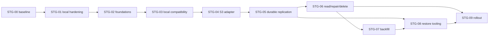

# Roadmap реализации storage, failover и backup/restore

## 1. Паспорт плана

- Проект: GarageBalance.
- Версия Roadmap: 1.0 от 22.09.2026.
- Baseline: ветка `master`, commit `e5309e8ae851d6a5f4ce4960e01066ded651e8fb`.
- Исходный dirty state: untracked `docs/storage-backup-multistorage-audit-2026-09-22.md`; он не изменялся этим запуском.
- Режим: `FULL_IMPLEMENTATION`; реализация разрешена владельцем 22.09.2026.
- Главные источники: `STORAGE_AUDIT.md`, `STORAGE_EVIDENCE.md`, `STORAGE_RISK_REGISTER.md`, `STORAGE_IMPLEMENTATION_TASK.md`, project `AGENTS.md`.
- В охвате: source/config/tests/docs/deployment/history. Production/provider accounts и destructive drills не исследованы.
- Фактически выполнено: focused baseline `TEST-001` — 40/40 passed; 2 local dumps прошли `pg_restore --list`; full suite и real-provider tests сейчас не запускались.

### Статусы

`READY` — можно начинать; `TODO` — зависит от других задач; `BLOCKED` — требует внешнего решения/resource; `IN_PROGRESS` — реализуется; `DONE` — реализовано и проверено; `DEFERRED`/`NOT_REQUIRED` объясняются отдельно.

### Цели

1. Сохранить current local-only installations и contracts.
2. Защитить DB backup от потери одного host/disk.
3. Автоматически выбирать разрешённый destination при read/write/backup failure.
4. Хранить partial/UNKNOWN state durable и безопасно repair/failback.
5. Доказать restore DB + keys/config + application.
6. Не строить cloud storage для отсутствующих workloads.

### Non-goals

PostgreSQL HA/PITR, public media/CDN, new cloud-drive adapters, browser direct backup upload, automatic production restore, irreversible lifecycle cleanup и перенос transient reports/import/logs — не первая версия.

## 2. Baseline и ожидаемый результат

Сейчас business source of truth — PostgreSQL. Local backup service создаёт validated custom dump, но каталог — список файлов; независимых copies/checksums/replicas/jobs/failover нет. Keys/config восстанавливаются только вручную; Access staging не имеет orphan TTL. Подробности: `EVID-003..033`.

Результат: existing backup flow сохраняется, но каждый dump становится logical object с immutable generation, SHA/manifest, local replica и durable remote debts. Один S3-compatible adapter обслуживает N explicitly configured destinations; A failure does not block permitted B. Read/restore chooses only actual verified current replica. Recovery catches up returned destination before failback. Migration CLI proves historical coverage. Regular isolated restore includes protected test secret and app smoke.

Граница: если `pg_dump`/catalog/keys/staging недоступны или ни одна current copy не существует, система не может корректно имитировать успех.

## 3. Решения и целевая policy

Roadmap принимает `DEC-001..010` из ТЗ. Ключевые значения `PROPOSED`:

| Data class | Pool | Writers / fallback | Readers | Required / desired | ACK/degraded | Tier/retention | RPO/RTO |
|---|---|---|---|---|---|---|---|
| DB backup | `DatabaseBackupsPool` | local staging; remote A -> B | verified local -> A -> B | required 2 independent total incl. ≥1 off-site; desired 3 | local creation is not full protection; debt explicit | local+remote hot; cold gated; 48 four-hourly/30 daily/12 monthly proposed | DB RPO ≤4h; restore ≤4h proposed |
| Key/config bundle | `RecoverySecretsPool` | encrypted A -> B | restore tool/operator | 2 independent encrypted copies proposed | no plaintext pending success | hot; archive gated | RPO ≤24h/after change; DR ≤8h proposed |
| Access staging | local temp | one bounded path | worker only | 1 temporary | re-upload on loss | TTL/quarantine | no recovery promise |
| Exports/logs | none/local | current behavior | current behavior | none/one | no DR promise | current retention | `NOT REQUIRED` |

## 4. Предположения, зависимости и safety constraints

- `ASSUMPTION-001`: current full logical dumps remain sufficient for first release; PITR is deferred.
- `ASSUMPTION-002`: PostgreSQL remains available to catalog/jobs during normal replication. Its HA is an acknowledged shared dependency.
- `ASSUMPTION-003`: two independent off-site accounts/providers can later be provisioned. Without them, `REQ-002` remains operationally blocked.
- All schema changes additive; no source delete during backfill/observation.
- Secrets never requested in chat or committed.
- Real provider calls/fault injection/restore production require explicit owner/operator authorization.
- Before any data-affecting rollout, latest independent restore point and isolated restore evidence are required.
- No task crosses a failed gate. Unknown outcome is persisted/reconciled, not guessed.

## 5. Stage map

| Stage | Goal/result | Priority | Dependencies | Tasks | Entry | Exit | Role | Status |
|---|---|---|---|---|---|---|---|---|
| `STG-00` | Freeze baseline/contracts | P0 | none | `TASK-001..002` | implementation permission | characterization and decisions register | Codex + owner for policy | `DONE` |
| `STG-01` | Harden current local system | P0 | STG-00 | `TASK-003..005` | baseline green | SHA/manifest, freshness, permissions, orphan cleanup green | Codex | `DONE` |
| `STG-02` | Add policy/provider/catalog foundations off by default | P0 | STG-01 | `TASK-006..007` | restore point | additive schema/options/feature-off compatibility | Codex | `DONE` |
| `STG-03` | Preserve current local behavior through new abstraction | P0 | STG-02 | `TASK-008` | schema deployed locally | local contract parity and registered existing files | Codex | `DONE` |
| `STG-04` | Add secure S3-compatible destination | P0 | STG-03 | `TASK-009` | isolated test S3 | adapter contract + security green | Codex/operator for real test | `DONE` |
| `STG-05` | Durable replication and write/backup fallback | P0 | STG-04 | `TASK-010..011` | adapter green | partial/UNKNOWN/restart/all-failed tested | Codex | `DONE` |
| `STG-06` | Read failover, repair, delete, UI/API | P0 | STG-05 | `TASK-012..016` | durable copies | current-generation read, recovery/failback/delete/UI tests green | Codex | `DONE` |
| `STG-07` | Historical inventory/backfill and coverage proof | P0 | STG-06 | `TASK-018` | CLI + destinations | retained objects verified; rollback lookup proven | Codex/operator | `DONE` (tooling; real coverage awaits destinations) |
| `STG-08` | Prove full restore and key/config recovery | P0 | STG-05, STG-07 | `TASK-019..021` | independent copy | weekly verifier + one full DR drill evidence | Codex/operator/owner | `BLOCKED` on independent provider DR drill |
| `STG-09` | Observe, pilot, roll out and accept | P1 | STG-06..08 | `TASK-017`, `TASK-022..024` | all gates green | observation accepted; runbooks/current release note | Codex/operator/owner | `BLOCKED` on rollout/performance acceptance |

Parallelism: after `TASK-009`, restore tooling design (`TASK-019/020`) can proceed alongside UI work, but real DR drill waits for verified backfill. Schema/catalog tasks cannot be implemented concurrently by independent branches without coordination. No retention cleanup and bulk migration run concurrently before policy locking is proven.

## 6. Stage cards

### STG-00 — Baseline and decisions

- Goal: protect existing behavior before refactor; cover `REQ-001`, `REQ-012`, `RISK-017`.
- Sequence: `TASK-001` characterization matrix, then `TASK-002` owner policy inputs/defaults.
- Touchpoints: existing tests, configs, UI/API contracts; no schema/data changes.
- Interim behavior: unchanged.
- Exit evidence: focused/full affected baseline, old-config fixtures, accepted or explicitly provisional policy values.
- Rollback: not applicable; documentation/tests only.
- Failure: stop if baseline is red; diagnose before storage changes.

### STG-01 — Local hardening

- Goal: reduce immediate risks without cloud dependency; cover `RISK-002`, `RISK-003`, `RISK-006`, `RISK-009`.
- Sequence: `TASK-003` SHA/manifest, `TASK-004` freshness/permissions, `TASK-005` import sweeper.
- Compatibility: same backup filenames/routes/directory and import workflow.
- Interim state: local-only but measurable; manifests additive.
- Exit: checksum verified, stale state testable, missed-window catch-up defined, active import files preserved.
- Rollback: disable sweeper/catch-up; old dumps remain valid; sidecars can remain ignored.

### STG-02 — Foundations

- Goal: model destinations/policies/copies/jobs while feature remains off; cover `REQ-003..005`, `RISK-003`, `RISK-016`, `RISK-020`.
- Sequence: `TASK-006` contracts/config, `TASK-007` additive schema/catalog.
- Interim state: old backup service still authoritative; no remote I/O.
- Exit: migration passes PostgreSQL tests, missing Storage maps to `Single`, manifests contain no secrets, job leases tested.
- Rollback: previous binary ignores additive tables; no down migration.

### STG-03 — Local adapter compatibility

- Goal: route current local operations through common contract without user-visible regression.
- Task: `TASK-008`.
- Interim state: `Storage.Mode=Single`; existing files registered lazily/inventory; API routes unchanged.
- Exit: byte-for-byte download, filename, Range, permissions, audit, retention and pre-update parity.
- Rollback: feature flag to legacy path/previous binary; never rename/delete local files.

### STG-04 — S3-compatible adapter

- Goal: one vendor-neutral adapter with explicit capabilities and safe config.
- Task: `TASK-009`; covers `REQ-002/003/010/016`.
- Entry: isolated MinIO/test S3 and no production credentials.
- Exit: private streaming upload/read/stat/delete, error mapping, cancellation, timeout, optional signed GET/multipart tests.
- Rollback: disable destination; local mode unaffected.
- Real-provider capability remains unverified until operator-approved test.

### STG-05 — Replication and backup destination failover

- Goal: durable per-copy progress and automatic A→B delivery; cover `RISK-012`, `RISK-014`.
- Sequence: `TASK-010` worker/state machine, `TASK-011` router/ACK/all-failed.
- Interim: local source retained; remote feature initially shadow/report-only.
- Exit: A success/B fail/C success, lost response, restart, two required/one available, all down and multi-instance scenarios pass.
- Stop: any false protected status, source cleanup before verification, duplicate logical object or unbounded retry.
- Rollback: stop assigning jobs/set Single; retain jobs/objects for later resume.

### STG-06 — Read, recovery, delete and interface

- Goal: serve only correct bytes and recover safely; cover `RISK-008`, `RISK-013`, `RISK-015`.
- Sequence: `TASK-012` read router, `TASK-013` operation-scoped health/error mapping, `TASK-014` reconcile/recovery, `TASK-015` delete, `TASK-016` API/UI.
- Interim: read fallback behind flag; recovery destination marked `Recovering` until verified.
- Exit: current generation/fallback/stream interruption/B-only/failback/tombstone tests green.
- Rollback: proxy local remains; do not disable locator lookup for B-only objects.

### STG-07 — Migration/backfill

- Goal: prove existing retained backups are covered before claims of failover; task `TASK-018`.
- Flow: inventory -> dry-run -> local registration -> A copy/verify -> B copy/verify -> delta/tombstones -> coverage/cutover-check.
- Exit: zero unexplained objects, required coverage met or explicit blocked list, resume and rollback-check proven.
- Stop: checksum mismatch, lost source, catalog divergence, capacity/quota, new changes not captured.
- No source delete in this stage.

### STG-08 — Restore and DR

- Goal: make backup operationally meaningful; cover `RISK-001`, `RISK-004`, `RISK-005`, `RISK-020`.
- Sequence: `TASK-019` verifier, `TASK-020` encrypted recovery bundle, `TASK-021` full drill.
- Interim: all restores isolated; production remains untouched.
- Exit: independent copy restores DB, protected test secret decrypts, API read-only smoke passes, measured RPO/RTO recorded.
- Rollback: destroy only disposable test environment; preserve evidence and backup.

### STG-09 — Observability, rollout and handoff

- Goal: enable safely and prove sustained operation.
- Sequence: `TASK-017` metrics/alerts, `TASK-022` staged enablement, `TASK-023` performance/fault gate, `TASK-024` docs/release/acceptance.
- Rollout: feature-off -> shadow jobs -> A -> B -> backfill -> read fallback -> delivery fallback -> recovery/failback -> retention-aware cleanup later.
- Observation window duration is owner/operator decision; no invented date.
- Rollback: Single mode + keep catalog/all copies; backfill B-only to local before removing router.
- Exit: all ACs, real-provider evidence, no critical alerts/debt, owner acceptance.

## 7. Task cards

### TASK-001 — Characterization/non-regression baseline

- Stage/status/priority: `STG-00`, `DONE`, P0. Links: `REQ-001`, `REQ-012`, `RISK-017`, `AC-001/015`.
- Result: machine-readable fixtures/tests freeze current backup API DTO/routes, filename regex, Range, permissions/audit, schedule/pre-update, old appsettings/env/compose, Access/import/log/1C/receipt behavior.
- Touchpoints: existing `Api.Tests/DatabaseBackups/*`, `Deployment/BackupScriptTests.cs`, `Controllers/SettingsControllerTests` or focused new backup controller tests; frontend `settingsApi`/`PasswordPanel` tests; config tests. No production code unless a testability seam is strictly required.
- Actions: inventory public contracts; add missing success/invalid/permission/failure/cancellation tests; create old-config fixture without `Storage`; record current OpenAPI subset and UI accessible names.
- Invariants: tests describe current behavior, not target assumptions; do not weaken existing assertions.
- Verification: focused backend/frontend tests then affected full suites once stable. Expected exit 0 and stable contract snapshots. Side effect: test artifacts only.
- Failure/rollback: a failing baseline blocks refactor; determine product defect vs expected contract, never rewrite test to hide it.
- Output: baseline matrix and green commands; unlocks `TASK-003..006`.

### TASK-002 — Resolve policy parameters and external gates

- Stage/status/priority: `STG-00`, `DONE` with provisional values and external approval gates retained, P0. Links: `REQ-002/008/009/016`, `DEC-009`.
- Result: approved or explicitly provisional RPO/RTO, retention, required/desired copies, regions, budget, providers/accounts, alert owner, real-test/DR permissions.
- Touchpoints: this Roadmap decision log; later deployment secret system. No code/data.
- Actions: present recommended defaults; owner chooses only business/external parameters; operator confirms failure-domain independence and secret-reference mechanism. Never collect secret values in chat/docs.
- Contracts: if unanswered, local implementation proceeds with `PROPOSED` defaults but provider provisioning/cutover tasks stay `BLOCKED`.
- Verification: written decision IDs and capability evidence links dated at selection time.
- Failure/rollback: revise policy before external spend/irreversible retention.
- Output: policy revision 1; unlocks final config/cutover, not local foundations.

### TASK-003 — SHA-256 and atomic manifest for current dumps

- Stage/status/priority: `STG-01`, `DONE` after `TASK-001`, P0. Links: `REQ-008`, `RISK-003/004`, `AC-002`.
- Result: every new final dump has streamed SHA-256 and an atomic, non-secret manifest; existing filename remains.
- Touchpoints: `PostgresDatabaseBackupService.CreateAsync()`; backup contracts; proposed manifest DTO/helper; tests; scripts aligned later.
- Actions: after TOC verification/finalization stream hash with cancellation; write `.manifest.json.tmp` then rename; include stable backup ID, size, hash, kind, PostgreSQL/app version, UTC; validate/read manifest; ensure partial manifest cleanup.
- Invariants: no connection string/PII/secret; hash covers exact final bytes; dump is not deleted if manifest/audit registration fails; current route still sees dump.
- Data: no DB migration; sidecar is additive; historical manifests produced by `TASK-018` only after verification.
- Verification: tests for success, empty/corrupt, cancellation, manifest-write failure, same bytes/hash, Unicode/encoding, no secrets. Run focused DatabaseBackups + build.
- Failure/rollback: old code ignores sidecar; retain dump and surface manifest failure/degraded state.
- Output: verified local artifact contract; unlocks catalog and remote verification.

### TASK-004 — Freshness/catch-up and least-privilege backup permissions

- Stage/status/priority: `STG-01`, `DONE` after `TASK-001`, P0. Links: `REQ-008/010/011`, `RISK-002/009`, `AC-016/017`.
- Result: missed schedule is caught up under bounded rule; stale backup exposed safely; backup permissions separated.
- Touchpoints: `DatabaseBackupAutomation.cs`, options/DTO, `SettingsController`, `SystemPermissions`, role seeds/migration, frontend access controls/tests, docs.
- Actions: define due timestamp independent of current window, with single bounded catch-up; add stale thresholds and structured event; introduce `backups.read/create/download/delete/repair`; administrator gets rights through additive migration; remove absolute directory from API/UI.
- Invariants: no duplicate concurrent dump; pre-update unchanged; stale backup does not fail unrelated liveness; business authorization never bypassed.
- Verification: DST/window/API-down restart/concurrency/permission-denied/controller/UI tests; migration compatibility; privacy tests.
- Failure/rollback: feature flags/defaults retain current window; additive permissions remain, admin compatibility preserved.
- Output: measurable local RPO and least privilege.

### TASK-005 — Orphan Access staging sweeper

- Stage/status/priority: `STG-01`, `DONE` after `TASK-001`, P0. Links: `REQ-013`, `RISK-006`, `AC-015`.
- Result: stale unreferenced `.pending` files are quarantined/deleted after policy; active/ambiguous runs remain untouched.
- Touchpoints: `ImportDryRunQueue.cs`, import repository query, options, hosted worker or existing worker periodic path, metrics/tests.
- Actions: inventory only managed filename pattern; join DB statuses; quarantine unknown files for proposed 24h; later delete with audit/metric; enforce max workdir usage/backpressure; never follow symlinks/outside root.
- Invariants: queued/processing/recent files never deleted; no file content logged; cancellation/restart safe.
- Verification: orphan-before-row, row-before-file, active, failed, clock boundary, symlink/path, permission failure, restart tests. Focused Import tests.
- Failure/rollback: disable sweeper; quarantine keeps recovery possible; no recursive broad delete.
- Output: bounded privacy/disk risk.

### TASK-006 — Provider/capability/pool/policy contracts and validation

- Stage/status/priority: `STG-02`, `DONE` after `TASK-001/002`, P0. Links: `REQ-003/010/012`, `RISK-016/017`, `AC-003/015/016`.
- Result: vendor-neutral but capability-aware contracts, explicit destinations/roles/pools/policies, old-config `Single` default.
- Touchpoints: NEW `Application/Storage/*`; `Program.cs`; safe config examples/tests.
- Actions: define provider operations `OpenRead/Write/Stat/Delete/GetDownloadLink` only where capability advertises; represent native locator/version; validate IDs, roles, pools, fallback graph, failure-domain labels, endpoint/TLS/limits; reject policy requiring unsupported capability; preserve provider-specific extension seam.
- Invariants: provider != destination != policy; no arbitrary fallback; no secret fields in DTO/log; missing `Storage` is valid legacy mode; 1C/receipt untouched.
- Verification: unit matrix for local-only, local+A, local+A+B, disabled/draining/read-only, duplicate/empty/invalid/cycle/unsupported/tenant mismatch. Secret exposure tests.
- Failure/rollback: validation fails startup before data mutation; feature off uses legacy path.
- Output: `DEC-003/010` contracts; unlocks schema/adapter.

### TASK-007 — Additive catalog, replicas, jobs and manifests

- Stage/status/priority: `STG-02`, `DONE` after `TASK-003/006`, P0. Links: `REQ-004/005/007`, `RISK-003/020`, `AC-002/004/014`.
- Result: additive EF schema/entities/repository with atomic object+replica+job registration and optimistic concurrency.
- Touchpoints: NEW Domain entities and `EfStorageCatalog`; `GarageBalanceDbContext`; migration/model snapshot; PostgreSQL tests.
- Actions: implement schema from TЗ; state-transition guards; immutable generation; tombstone; idempotency keys; lease claim/release/expiry; manifest export/rebuild; bounded sanitized error fields/indexes.
- Invariants: unique logical operation/object and replica generation; no signed URL/secret in DB; jobs point to replayable bytes; state cannot regress from deleted/current to stale available.
- Compatibility: migration additive; current tables/data untouched; old binary ignores new schema.
- Verification: clean migrate, upgrade, pending-model check, constraints/index plans, concurrent registration/lease, restart, manifest rebuild, cancellation/transaction rollback. PostgreSQL required.
- Failure/rollback: roll forward/fix; do not destructive-down after catalog use. Local files remain authoritative in Single.
- Output: durable state foundation.

### TASK-008 — Local provider adapter and legacy parity

- Stage/status/priority: `STG-03`, `DONE` after `TASK-006/007`, P0. Links: `REQ-001/012`, `AC-001/015/019`.
- Result: current directory operates through local adapter/catalog without changed user contract.
- Touchpoints: NEW `LocalFileStorageProvider`; existing backup service/controller; DI; tests.
- Actions: safe root/path normalization; streaming/stat/delete; register new backups; lazy/inventory registration of old files; keep exact managed names, Range, audit, pre-update and retention behavior (except safer protection gate).
- Invariants: no traversal/symlink escape; local path not exposed; byte-for-byte same dump; old files downloadable before/after catalog registration.
- Verification: provider contract tests; existing 40-focused baseline plus controller/frontend; local-only old config; file-without-row/row-without-file; locked file/disk full/cancellation.
- Failure/rollback: `Storage.Mode=SingleLegacy`/feature flag or previous binary; never rename/delete source.
- Output: new architecture with zero required cloud dependency.

### TASK-009 — S3-compatible adapter and secure provider contract

- Stage/status/priority: `STG-04`, `DONE` after `TASK-006/008`, P0. Links: `REQ-002/003/010/016`, `RISK-016/019`, `AC-003/010/016/018`.
- Result: one adapter can serve N configured S3-compatible destinations with explicit capabilities.
- Touchpoints: API `.csproj`/lock; NEW `S3CompatibleStorageProvider`; options/DI; isolated integration fixtures; Docker CI only if justified.
- Actions: select maintained SDK/version; streaming put/get/head/delete; metadata SHA/generation; deterministic key; cancellation/timeouts; multipart above measured threshold; abort cleanup; optional signed GET; map native errors; private/TLS/encryption defaults; endpoint allowlist/path-style config.
- Invariants: ETag is not strong checksum; no public ACL, permanent frontend secret or blind server-side copy; adapter doesn't claim versioning/Object Lock until real config verified.
- Verification: MinIO/local isolated tests plus provider-specific sandbox later: bytes/hash, Range if supported, invalid creds, 403/404/409/429/5xx, timeout/reset, quota/read-only, lost response, cancellation, multipart abort, signed TTL. Two aliases of one bucket do not prove independence.
- Failure/rollback: disable destination; local mode continues; dependency rollback keeps additive catalog.
- Output: secure remote primitive; real provider remains gated.

### TASK-010 — Durable replication worker and multi-instance coordination

- Stage/status/priority: `STG-05`, `DONE` after `TASK-007/009`, P0. Links: `REQ-005/016`, `RISK-007/012/014/019`, `AC-004/018`.
- Result: jobs survive restart, claim once, stream replayable source, independently advance replicas and enforce resource budgets.
- Touchpoints: NEW worker/service; catalog/job repo; `Program.cs`; backup finalization; tests.
- Actions: create pending replicas/jobs transactionally; claim with `SKIP LOCKED`/lease; verify policy revision/source generation/tombstone; stream upload; record actual locator/unknown/result; jitter/backoff/dead-letter; fair per-destination concurrency; release/recover leases; keep local source until policy/retention.
- Invariants: one logical object; late completion cannot publish stale generation; durable job without source is blocked; SDK+worker retries share one budget; one destination failure does not block others.
- Verification: two workers, crash before/after upload/DB update, lost response, cancellation, restart, A success/B fail/C success, backlog/disk pressure, policy changed/draining, lease expiry. PostgreSQL + isolated S3.
- Failure/rollback: stop worker/assignments, preserve jobs/source/copies; resume after fix.
- Output: durable per-copy engine.

### TASK-011 — Backup write/destination failover and ACK semantics

- Stage/status/priority: `STG-05`, `DONE` after `TASK-010`, P0. Links: `REQ-002/005/008`, `RISK-012/014`, `AC-005/006/011`.
- Result: valid backup automatically tries eligible B when A unavailable and reports exact local/protection result.
- Touchpoints: backup orchestration/router/contracts/controller/UI preliminary status; policy tests.
- Actions: classify source vs destination failure; choose candidates by policy/capability/health; set overall deadline/max attempts; reconcile UNKNOWN before retry; calculate independent copy count; expose `CreatedLocal`, `ProtectionPending/Degraded`, `Protected`, `Failed`; all-down bounded staging/capacity alert.
- Invariants: required copies never reduced; A failure doesn't turn backup-only/readonly destination into writer; source failure never succeeds; no HTTP 202 without durable status lookup.
- Verification: A down pre-write, A wrote/lost response, B quota, all down, required=2/available=1, catalog down after physical write, source removed, retry client same operation ID.
- Failure/rollback: set remote delivery off; local dump remains and debt visible, not erased.
- Output: automatic backup destination fallback.

### TASK-012 — Version-aware read/restore router and proxy/direct access

- Stage/status/priority: `STG-06`, `DONE`, P0. Links: `REQ-006/010/016`, `RISK-013`, `AC-007/008/010`.
- Result: stable authorized endpoint returns exact committed bytes from eligible actual replica with bounded fallback.
- Touchpoints: NEW `StorageRouter`; `SettingsController.DownloadDatabaseBackup`; provider interfaces; frontend retry; tests.
- Actions: authorize -> resolve object/generation/tombstone -> filter actual replicas -> attempt priority; distinguish missing/stale/corrupt/outage; proxy bounded stream; preserve Range/length/type/disposition; optional signed link TTL≤5m; logical retry for failed direct URL.
- Invariants: 403 not bypassed; healthy provider without object ignored; no stale generation; after response starts no unsafe cross-replica splice; same SHA/generation required for resume.
- Verification: A down/B current, A 404, B stale, corrupt hash, only A copy down, Range 206/416, cancellation, mid-stream failure, direct URL retry, non-supporting client, permission denied.
- Failure/rollback: local proxy remains; remote-read flag disabled only after B-only objects backfilled local.
- Output: read/restore failover with honest boundary.

### TASK-013 — Operation-scoped health, errors and circuit budgets

- Stage/status/priority: `STG-06`, `DONE`, P0. Links: `REQ-003/005/010/016`, `RISK-013/016/019`, `AC-008/018`.
- Result: native errors map to stable categories; read/write/backup eligibility and breakers are separate; flapping/retry storm bounded.
- Touchpoints: provider contracts/adapters/router/worker; safe aggregate diagnostics and tests.
- Actions: implement categories from TЗ; passive results + limited half-open probes; per-attempt and overall deadlines; retry-after/jitter; separate concurrency pools; states `Healthy/Degraded/Unavailable/Recovering/Disabled/Draining` per operation.
- Invariants: one 404 does not disable provider; read-only write failure does not block reads; TLS is never disabled; provider forbidden does not bypass business authorization; probes require no new privilege.
- Verification: 403/404/409/429/5xx/OAuth-not-applicable/TLS/quota/read-only/slow/flapping/cancellation matrices; assert attempts and elapsed/resource budgets.
- Failure/rollback: disable active probing and retain direct operation attempts with safe limits; no global app liveness coupling.
- Output: eligibility input for routing/recovery and metrics.

### TASK-014 — Reconciliation, repair, catch-up and failback

- Stage/status/priority: `STG-06`, `DONE`, P0. Links: `REQ-007`, `RISK-013/015`, `AC-008/009`.
- Result: missing/stale/corrupt replicas are detected and repaired from authoritative copy; returning provider catches up before priority return.
- Touchpoints: NEW reconciliation service/worker; catalog; CLI hooks; metrics/tests.
- Actions: inventory expected objects; bounded stat/sample/full hash; classify divergences/orphans; schedule idempotent repair; verify target; apply tombstones/generation; cooldown/hysteresis; object-level readiness; quarantine mass-corruption/security suspicion.
- Invariants: former primary is not truth by name; timestamp alone doesn't resolve conflict; no repair from unverified/stale source; B-only current remains readable; no resurrection.
- Verification: A returns with B-only objects, stale A, tombstone, both conflict, missing metadata, orphan remote, mass corruption, long backlog, rate limits, restart and failback flapping.
- Failure/rollback: pause repair, keep candidate/quarantine state and current router; operator resolves ambiguous conflict.
- Output: safe recovery loop.

### TASK-015 — Logical delete, retention and immutability gates

- Stage/status/priority: `STG-06`, `DONE`, P0. Links: `REQ-007/008`, `RISK-008`, `AC-014`.
- Result: delete is durable per replica; retention never removes last required/current/restore-dependent copy.
- Touchpoints: backup service/controller, catalog/jobs, provider delete, retention policy, tests, docs.
- Actions: tombstone first; create delete jobs; retry only failed destination; keep backup copies per retention; block late upload; protection-aware local cleanup; provider lifecycle dry-run; optional versioning/Object Lock only after capability and owner gate.
- Invariants: partial delete visible; legal/immutable retention honored; lifecycle cannot precede DB policy; source cleanup separate from migration.
- Verification: A deleted/B failed/C deleted, delayed stale upload, concurrent read/delete/repair, retention boundary, provider disabled, WORM rejection, DB failure after physical delete avoided.
- Failure/rollback: stop delete jobs; tombstone prevents user access while objects remain recoverable; irreversible provider lifecycle requires separate operator approval.
- Output: safe deletion/retention.

### TASK-016 — Admin API/UI protection and recovery workflow

- Stage/status/priority: `STG-06`, `DONE`, P1. Links: `REQ-010/011/012`, `RISK-009/010`, `AC-005/010/015/017`.
- Result: administrator sees truthful protection, copies, lag/error/last verify and can retry/verify according to permission; existing actions remain.
- Touchpoints: `SettingsController`, contracts/OpenAPI, `settingsApi.ts`, `PasswordPanel.tsx`, CSS/accessibility tests.
- Actions: additive safe DTO; endpoints retry/verify/direct-link; status pills and help tooltip; logical download retry; no path/bucket/secret; separate permission states/loading/errors; audit actions.
- Invariants: UI is not authorization; no `Protected` unless policy met; signed URL ephemeral; errors actionable but sanitized.
- Verification: controller success/validation/permission/corrupt/all-failed; component loading/empty/degraded/protected/retry/direct fallback/keyboard/accessibility; old response compatibility if supported.
- Failure/rollback: hide new controls/feature flag; existing proxy actions work.
- Output: operable user-visible feature; release note later.

### TASK-017 — Metrics, alerts and safe health exposure

- Stage/status/priority: `STG-09`, `DONE` for local metrics/deduplicated structured alerts; external alert channel remains an owner rollout action, P1. Links: `REQ-011/016`, `RISK-002/010/019`, `AC-017/018`.
- Result: measurable RPO/protection/failover/debt/restore status with deduplicated alerts and recovery notification.
- Touchpoints: existing logging/health framework, metrics integration if already present or minimal structured status, diagnostics UI/runbook.
- Actions: instrument operation/destination without high-cardinality PII; stale/debt/all-failed/staging/quota/restore-age thresholds; liveness vs workload readiness; alert owner/escalation; cooldown/flapping metrics.
- Invariants: green creation does not hide unmet copies; optional archive outage not global unhealthy; no secret/signed URL labels.
- Verification: synthetic state tests, alert fire/recover/dedupe, public response privacy, prolonged degradation, provider recovery.
- Failure/rollback: disable alert transport, retain local structured events; never disable backup because notification fails.
- Output: observation gate data.

### TASK-018 — StorageTool inventory, migration, backfill and coverage

- Stage/status/priority: `STG-07`, `DONE` for resumable tooling; execution against retained customer data awaits configured destinations, P0. Links: `REQ-014/015`, `RISK-018`, `AC-013/019`.
- Result: operator CLI performs inventory/plan/dry-run/copy/verify/diff/delta-sync/resume/repair/status/report/cutover-check/rollback-check with checkpoints.
- Touchpoints: NEW `backend/GarageBalance.StorageTool`; solution; catalog/providers; docs/tests.
- Actions: snapshot/checkpoint; capture new object/tombstone generations via catalog; stream batches; concurrency/rate caps; strong verify; durable run cursor; sanitized JSON/CSV report; no source delete command in migration path.
- Invariants: idempotent repeat; older source never overwrites current; metadata/content headers preserved; cancellation/resume safe; unknown/corrupt objects reported, not guessed.
- Verification: live concurrent create/delete/update-generation simulation, restart at each phase, checksum mismatch, quota, source unavailable, delta completeness, rollback lookup. Commands default dry-run/no delete.
- Failure/rollback: stop at checkpoint; current router remains local; copied objects retained; fix/re-run only failed set.
- Output: signed/archived coverage report required for cutover.

### TASK-019 — Automated isolated restore verifier

- Stage/status/priority: `STG-08`, `DONE` locally; independent-provider restore remains under `TASK-021`, P0. Links: `REQ-008`, `RISK-004/020`, `AC-012`.
- Result: scheduled operator job selects verified independent source and restores only disposable PostgreSQL, then performs schema/control/app smoke.
- Touchpoints: NEW safe script/tool commands; `restore-postgres.ps1`, VPS scripts, CI/operator schedule, docs/tests.
- Actions: source selection by freshness/protection/tier; fetch/check SHA/TOC; create unique disposable DB; `pg_restore --exit-on-error`; migration/table/control checks; isolated read-only API readiness/login/report smoke; always clean disposable DB; persist result/age.
- Invariants: never target protected production names without explicit separate destructive workflow; no mixing restore points; secrets masked.
- Verification: hot A, fallback B, corrupt A, missing key, old point warning, cancellation/cleanup, app smoke failure. Real PostgreSQL required.
- Failure/rollback: preserve failing artifact/evidence securely if approved; cleanup disposable resources; alert, no production mutation.
- Output: restore-tested state and measured duration.

### TASK-020 — Encrypted Data Protection/config recovery bundle

- Stage/status/priority: `STG-08`, `DONE` for authenticated encrypted bundle and local round trip; operator-held key provisioning remains external, P0. Links: `REQ-009/010`, `RISK-005`, `AC-012/016`.
- Result: versioned authenticated-encrypted key/config recovery package with independent key/credential and no plaintext secret archive.
- Touchpoints: new operator-only packaging/restoration utility/script; Data Protection docs/options; `RecoverySecretsPool`; security tests.
- Actions: inventory exact key ring + non-secret config + secret references; encrypt client-side or approved KMS envelope; upload to two destinations; manifest encryption metadata reference; rotate after changes; restore into isolated ACL-controlled path.
- Invariants: never include plaintext `.env` in object/log/report; encryption key not stored beside bundle; existing key files unchanged; least-privilege restore role.
- Verification: round-trip decrypt, wrong/missing key fails clearly, existing protected test secret decrypts, bundle/log scan has no plaintext, rotation/version selection.
- Failure/rollback: retain original key ring; no production key replacement; revoke bad bundle and create new version.
- Output: full-DR prerequisite.

### TASK-021 — Full disaster-recovery drill and runbook validation

- Stage/status/priority: `STG-08`, `BLOCKED` until provider resources/owner permission and `TASK-018..020`, P0. Links: `REQ-002/008/009`, `RISK-001/004/005/020`, `AC-012/020`.
- Result: from independent copy and recovery bundle, rebuild isolated app, verify business-level read-only checks, record actual RPO/RTO.
- Touchpoints: operator environment, restore tool/scripts, deployment docs; no production target.
- Actions: simulate loss of primary host logically in isolated environment; obtain catalog/manifests without production DB; restore DB/keys/config references; launch API/frontend; health/login/report/control totals; capture timings/gaps; destroy test environment securely.
- Invariants: no real production outage/DNS block; no raw PII in report; destructive production switch excluded.
- Verification: checklist evidence, command exit codes, version/hash/source, actual timings and owner sign-off; repeat from alternate destination if required.
- Failure/rollback: stop, preserve sanitized diagnosis, retain old recovery points, do not certify.
- Output: operational restore evidence and updated risks.

### TASK-022 — Staged deployment, provider provisioning and failover enablement

- Stage/status/priority: `STG-09`, `BLOCKED` on `TASK-002/021` and external resources, P0. Links: `REQ-002/015`, `RISK-018`, `AC-006/007/009/019`.
- Result: production progresses feature-off -> A -> B -> verified backfill -> read/write/recovery flags with observation gates.
- Touchpoints: deployment secrets/config, Docker/systemd, migrations/binaries, operator runbook.
- Actions: backup/restore prerequisite; deploy additive schema and Single; provision A/B private with independent failure domains; capability test objects; enable shadow jobs/new backup replication; backfill; verify; enable read fallback then delivery fallback then recovery/failback; never cleanup source in same change.
- Invariants: no manual env switch per incident after enablement; rollback keeps B-only locators accessible; stop on debt/corruption/alert/security anomaly.
- Verification: canary/test backup and fault scenarios with explicit permission; coverage and protection dashboard; observation window.
- Failure/rollback: disable new assignments/router only after local availability check; preserve catalog/copies; previous binary if schema additive.
- Output: controlled production activation.

### TASK-023 — Performance, capacity and fault gate

- Stage/status/priority: `STG-09`, `BLOCKED` for realistic provider/capacity measurements; bounded streaming, queue and retry controls are implemented and locally tested, P1. Links: `REQ-016`, `RISK-011/019`, `AC-018`.
- Result: measured bounded RAM/disk/network/queue, retry/failover deadlines and capacity model on realistic sanitized size distribution.
- Touchpoints: benchmarks/load fixtures/metrics/options; no production fault without permission.
- Actions: large file streaming, concurrent backups, slow/dead A with healthy B, long backlog, disk/staging threshold, repair plus runtime, cancellation, restore egress; set final budgets from evidence.
- Invariants: no full multi-GB buffering; repair/backfill lower priority; all queues bounded; cancellation releases resources.
- Verification: recorded peaks/latency/lag and exit thresholds; repeatable isolated commands; no threshold invented as measured.
- Failure/rollback: reduce concurrency/disable multipart/direct; do not publish until gate passes.
- Output: production values and cost estimate inputs.

### TASK-024 — Documentation, release note, final traceability and handoff

- Stage/status/priority: `STG-09`, `DONE` for implementation documentation/release/handoff; final owner acceptance remains under `TASK-021..023`, P1. Links: all `REQ`, `AC-020`.
- Result: current runbooks and user-facing “Что нового”, closed traceability, residual risks/decisions, operations ownership.
- Touchpoints: listed docs, `AppReleases/releases.json`, Roadmap history/checkpoint, evidence/risk register.
- Actions: document add/drain provider, incident/degraded states, backup/restore/migration, key recovery, rollback, irreversible gates; release note for staff; reconcile every REQ/RISK/TASK/TEST/AC; record real results.
- Invariants: no secrets/internal paths in release note; future tests not marked passed; residual owner acceptance explicit.
- Verification: docs/deployment/privacy checks, link/command review, final full publication gate, owner/operator walkthrough.
- Failure/rollback: correct docs/evidence before acceptance; release note not published early.
- Output: operational handoff and final checkpoint.

## 8. Schema/data migration, rollout and rollback sequence

| Gate | Required evidence | Approver | Blocks | Preserved data / rollback |
|---|---|---|---|---|
| `GATE-01 Baseline` | `TASK-001` green, current restore point | Codex/owner | schema work | no changes |
| `GATE-02 Additive schema` | migration/upgrade tests, Single old-config | Codex | adapter activation | old binary + local files |
| `GATE-03 Local parity` | same bytes/routes/Range/audit/pre-update | Codex | remote writes | legacy/local flag |
| `GATE-04 Provider capability` | isolated adapter contract + security | Operator/Codex | real destination | disable provider |
| `GATE-05 Durable state` | partial/UNKNOWN/restart/multi-instance tests | Codex | failover flags | stop workers, keep jobs |
| `GATE-06 Historical coverage` | inventory/backfill/delta report, required copies | Operator | read/write failover | source untouched; locator lookup |
| `GATE-07 Restore` | independent-copy full DR drill | Owner/operator | production activation | previous recovery points |
| `GATE-08 Read failover` | current generation A-down/B-read test | Owner/operator | write fallback | disable read flag only after B-only backfill |
| `GATE-09 Delivery failover` | A-down/B-write + all-down/degraded tests | Owner/operator | recovery/failback | stop new remote assignments |
| `GATE-10 Recovery` | B-only catch-up/tombstone/flapping tests | Owner/operator | retention cleanup | keep A recovering/disabled |
| `GATE-11 Cleanup` | observation accepted; rollback window expired | Owner only | source/provider removal | irreversible actions separately approved |

Rollback is not merely setting primary back to A. Before disabling new router, every post-cutover B-only current object must have a verified readable local/A copy or compatibility lookup remains active. Additive tables and remote objects remain during rollback; down migrations/source deletion are prohibited until `GATE-11`.

## 9. Backup/restore proof before risky actions

1. Produce current local dump and SHA/manifest.
2. Restore to disposable DB and pass schema/control checks.
3. After A is configured, copy/verify and restore from A.
4. After B is configured, repeat from B/account independent of A.
5. Create encrypted recovery bundle and prove test-secret decryption.
6. Launch isolated API on restored DB/key set and run read-only smoke.
7. Record actual RPO/RTO and source/version/hash.
8. Only then allow backfill cutover/failover; production destructive restore is still separate.

## 10. Test and acceptance traceability

| Requirement/Risk | Evidence/Decision | Stage/Task | TEST/AC | Environment | Expected evidence | Current status |
|---|---|---|---|---|---|---|
| `REQ-001`, `RISK-017` | `EVID-004..015`, `DEC-001` | `STG-00/03`, `TASK-001/008` | `TEST-001`, `AC-001/015` | local/CI | old contract suites green | Baseline focused pass; target TODO |
| `REQ-002`, `RISK-001` | `EVID-016/032`, `DEC-002/009` | `STG-04/08/09`, `TASK-009/021/022` | `AC-011/012` | isolated real providers/DR | independent copy restore | `BLOCKED` external |
| `REQ-003`, `RISK-016` | `DEC-010` | `STG-02/04`, `TASK-006/009/013` | `AC-003/016` | unit + provider sandbox | capability/policy matrix pass | `TODO` |
| `REQ-004`, `RISK-003/020` | `EVID-010/033`, `DEC-003/004` | `STG-02`, `TASK-007` | `AC-002/004` | PostgreSQL | atomic catalog/jobs, rebuild | `TODO` |
| `REQ-005`, `RISK-012/014` | `DEC-002..004` | `STG-05`, `TASK-010/011` | `TEST-WRITE-01`, `AC-004..006` | PostgreSQL + S3 fixture | exact states after failure/restart | `TODO` |
| `REQ-006`, `RISK-013` | `DEC-005/010` | `STG-06`, `TASK-012/013` | `TEST-READ-01`, `AC-007/008/010` | API + two fixtures | exact bytes/generation/deadline | `TODO` |
| `REQ-007`, `RISK-008/015` | `DEC-004` | `STG-06`, `TASK-014/015` | `TEST-RECOVERY-01`, `AC-009/014` | integration/fault | B-only/tombstone preserved | `TODO` |
| `REQ-008`, `RISK-002/004` | `EVID-006/014/024` | `STG-01/08`, `TASK-003/004/019/021` | `AC-002/012/017` | PostgreSQL + isolated app | scheduled full restore | `TODO` |
| `REQ-009`, `RISK-005` | `EVID-017/032`, `DEC-008` | `STG-08`, `TASK-020/021` | `AC-012/016` | isolated DR | protected secret decrypts | `TODO` |
| `REQ-010`, `RISK-009/016` | `EVID-012/026` | `STG-01/04/06`, `TASK-004/009/016` | `AC-010/016` | backend/frontend/security | no bypass/secret exposure | `TODO` |
| `REQ-011`, `RISK-010` | `EVID-022` | `STG-06/09`, `TASK-016/017` | `AC-017` | component/integration | alert fire/recover; safe status | `TODO` |
| `REQ-012` | `EVID-018..027` | all baseline-sensitive | `TASK-001/005/008/024` | full affected suites | existing flows green | `TODO` |
| `REQ-013`, `RISK-006` | `EVID-018` | `STG-01`, `TASK-005` | `AC-015` | filesystem/DB tests | no active deletion; orphan cleanup | `TODO` |
| `REQ-014/015`, `RISK-018` | `DEC-007` | `STG-07/09`, `TASK-018/022` | `AC-013/019` | CLI + providers | resumable coverage/rollback report | `TODO` |
| `REQ-016`, `RISK-019` | `DEC-002/006` | `STG-05/09`, `TASK-010/013/023` | `AC-018` | load/fault | bounded resources/measured budgets | `TODO` |

## 11. Verification commands and environments

### Scenario test catalog

All tests below are `PROPOSED` until their implementing task is complete; `TEST-001..004` in Evidence are the only tests/checks already executed.

| Test ID | Prerequisites / action | Expected bytes, state and budget evidence | Links |
|---|---|---|---|
| `TEST-WRITE-01` | A unavailable before upload; B eligible | B receives exact SHA/generation, actual locator persisted, no manual config switch, within proposed deadline | `TASK-011`, `AC-006` |
| `TEST-WRITE-02` | A stores object but response/DB update lost; retry same operation | one logical object; replica reconciled from `Unknown`; no duplicate business effect | `TASK-010/011`, `AC-004` |
| `TEST-WRITE-03` | A success, B fail, C success | A/C available, B debt only; copy counts/protection exact after restart | `TASK-010`, `AC-004/005` |
| `TEST-WRITE-04` | required=2, only one copy; then all writers down | no false Protected; bounded pending/degraded/error, staging/backpressure/alert recorded | `TASK-011/017`, `AC-005` |
| `TEST-READ-01` | A down, B has current verified generation | exact expected bytes/SHA from B within deadline, authorization/audit preserved | `TASK-012`, `AC-007` |
| `TEST-READ-02` | current file exists only on unavailable A | explicit unavailable/not-found, never empty/stale/foreign bytes with 200 | `TASK-012`, `AC-007/008` |
| `TEST-READ-03` | B stale/corrupt, C current | B excluded; C exact current bytes or honest error; repair debt created | `TASK-012/014`, `AC-008` |
| `TEST-STREAM-01` | proxy interrupted after response bytes | only same SHA/generation Range resume or explicit restart/error; no cross-version splice | `TASK-012`, `AC-010` |
| `TEST-DIRECT-01` | issued A URL fails; client retries logical endpoint | new authorized B URL/proxy; old session not reused; TTL and no credential leak | `TASK-012/016`, `AC-010` |
| `TEST-BACKUP-01` | A backup destination down/B healthy; separately `pg_dump` fails | valid backup stored/verified/registered on B; source failure remains failed | `TASK-011/019`, `AC-011` |
| `TEST-BACKUP-02` | upload succeeds but response/catalog update lost | same BackupId/locator reconciled; protection and restore-test states distinct | `TASK-010/011`, `AC-004/011` |
| `TEST-RECOVERY-01` | A returns after B-only new objects/generations | catch-up copies current bytes; reads remain valid; verified gate before priority return | `TASK-014`, `AC-009` |
| `TEST-RECOVERY-02` | A flaps; stale generation/tombstone present; mass corruption signal | bounded probes/retries; no resurrection/stale overwrite; mass repair quarantined | `TASK-013/014/015`, `AC-009/014/018` |
| `TEST-CONCURRENCY-01` | two API/workers, duplicate delivery, policy changes/draining mid-job | authoritative generation/lease; no forbidden destination write or duplicate publication | `TASK-007/010/013`, `AC-004` |
| `TEST-SECURITY-01` | 403/404/429/5xx/TLS/quota/read-only/cross-policy attempts | native category/action correct; no auth/TLS/tenant/policy bypass or secret exposure | `TASK-009/013/016`, `AC-016` |
| `TEST-COMPAT-01` | old config, local-only, feature off; Access/log/1C/receipt/report flows | all existing contracts and bytes/actions unchanged; no new credentials/scopes | `TASK-001/005/008`, `AC-001/015` |
| `TEST-MIGRATION-01` | backfill while new create/delete occurs; interrupt/resume/rollback-check | checkpoints/delta/tombstones complete; source intact; coverage and B-only lookup proven | `TASK-018`, `AC-013/019` |
| `TEST-RESTORE-01` | restore independent hot copy + encrypted key bundle into isolated environment | SHA/TOC/DB restore, secret decrypt, API smoke/control checks, measured RPO/RTO | `TASK-019..021`, `AC-012` |
| `TEST-PERF-01` | large files, slow A, healthy B, long repair backlog, cancellation | bounded RAM/disk/queue, measured latency/lag, runtime not starved | `TASK-010/013/023`, `AC-018` |

Commands are future implementation gates unless marked baseline. Exact test names may be introduced by tasks.

| Command | CWD / prerequisites | Expected | Side effects / status |
|---|---|---|---|
| `dotnet test GarageBalance.slnx --configuration Release --no-restore --filter "FullyQualifiedName~DatabaseBackups|..."` | repo; restored packages | exit 0; focused tests | build/test artifacts; baseline `TEST-001` already passed |
| `dotnet test GarageBalance.slnx --configuration Release` | repo; test PostgreSQL settings for facts | exit 0; full backend | build/test DBs; future publication gate |
| `npm test -- --run` via configured frontend scripts | `frontend`; `npm ci` complete | exit 0 | test artifacts; future |
| `npm run lint` and `npm run build` | `frontend` | exit 0 | `dist`; future publication |
| `dotnet tool run dotnet-ef migrations has-pending-model-changes` | repo/backend, tool restore | no pending model changes | read/model build; future |
| `PROPOSED COMMAND — dotnet run --project backend/GarageBalance.StorageTool -- inventory --dry-run` | implemented CLI, non-production config | report only, exit 0 | no object writes |
| `PROPOSED COMMAND — ... plan/copy/verify/delta-sync/resume/cutover-check` | isolated/provider-approved env | documented counts/hash/coverage | copy writes only; no source delete |
| `PROPOSED COMMAND — ... restore-verify --source <logical-id> --target-prefix gb_restore_check_` | disposable PostgreSQL, approved test keys | restore + smoke pass | creates/drops disposable resources only |

After .NET checks run `dotnet build-server shutdown`; after every task stop task-owned API/Vite/testhost/containers and audit processes/artifacts per `AGENTS.md`. Before push/publication run full applicable frontend/backend/privacy/migration/Docker/provider gates once; do not repeat unchanged successful suites.

## 12. Owner/operator actions and blockers

| Question/action | Why | Owner | Blocks | Work possible before | Decision moment |
|---|---|---|---|---|---|
| Confirm RPO/RTO/retention/copy counts | Defines protection and alerts | Product owner | final policy/cutover | all foundations with proposed defaults | before `TASK-022` |
| Select/provision two independent destinations/accounts/regions | Host-loss/provider resilience | Owner/operator | real tests/backfill/DR | local adapter, catalog, MinIO tests | before `TASK-021/022` |
| Provide secret references/workload identity, not values in chat | Secure access | Operator | real adapter test | all code/tests with fake isolated secrets | before provider sandbox |
| Approve real-provider fault tests | Verify native errors/capabilities | Owner/operator | operational certification | mocks/MinIO and code audit | before `GATE-04/08/09` |
| Approve isolated full DR drill and resources | Prove restore | Owner/operator | `GATE-07` | verifier implementation | before `TASK-021` |
| Choose alert channel/on-call | Actionable degradation | Owner | production alerts | metrics/events implementation | before observation |
| Approve immutable retention/Object Lock if wanted | Irreversible/cost/legal | Owner | only immutability/lifecycle | all hot-copy work | separate after stable rollout |

Never request access keys, tokens, `.env`, key material or raw dumps in conversation.

## 13. Deferred / not required

| Capability | Status | Reason / reconsideration gate |
|---|---|---|
| Persistent user files/media/mail attachments | `NOT_REQUIRED` | no such current data class; new feature triggers design |
| Google/Yandex/Mail/Dropbox/OneDrive adapters | `NOT_REQUIRED` | no existing integration or requirement |
| Direct browser backup upload | `NOT_REQUIRED` | DB creates server-side dump |
| PITR/WAL | `DEFERRED` | assess after owner RPO and DB scale |
| Cold/archive lifecycle | `DEFERRED` | provider/RTO/cost/restore evidence needed |
| Object Lock/WORM | `DEFERRED` | capability + irreversible retention approval |
| Separate message broker/worker service | `DEFERRED` | PostgreSQL jobs/hosted worker sufficient until measured contention |
| CDN | `NOT_REQUIRED` | no public media/hot object workload |
| Synchronous quorum write | `DEFERRED` | async protection matches current backup workflow; revisit strict compliance requirement |

## 14. Progress, history and checkpoint

### Progress summary

- Stages: 8/10 `DONE`; 2/10 `BLOCKED` only on external provider/owner acceptance; no local implementation stage remains in progress.
- Tasks: 21/24 `DONE`; `TASK-021/022/023` externally blocked. Local implementation completion: 87.5% of task cards; remaining 12.5% require independent destinations, permissions and representative capacity.
- Operational production acceptance is not claimed: real-provider certification, full independent-copy DR, measured production budgets and observation window remain open.

### Plan change log

| Date/version | Change |
|---|---|
| 22.09.2026 / 1.0 | Initial evidence-linked roadmap created. Realization not started. |
| 22.09.2026 / 1.1 | Implementation authorized. `STG-00` completed: backend baseline 40/40 and frontend settings API 16/16 passed; proposed policy values retained pending external provisioning approval. `STG-01/TASK-003` started. |
| 22.09.2026 / 1.2 | `STG-01` completed: atomic SHA-256 manifests and byte verification; damaged-download blocking; stale/catch-up status; five backup permissions and hidden server path; Access orphan quarantine/TTL and bounded work directory. Focused backend 71/71, frontend contracts 21/21 and backup UI 8/8 passed. `STG-02/TASK-006` started. |
| 22.09.2026 / 1.3 | `STG-02` completed: feature-off `Single` compatibility resolver; capability-aware destination/pool/policy validation; safe endpoint/key rules; additive object/replica/job catalog, idempotent atomic registration, optimistic versions and expiring leases. Unit/SQLite 17/17 and real local PostgreSQL migration/concurrency 1/1 passed; EF pending-model check clean. `STG-03/TASK-008` started. |
| 22.09.2026 / 1.4 | `STG-03` completed: local provider contract for atomic write/adopt, read/stat/delete and checksum enforcement; backup create/download/delete/retention routed through it; manifest v2 carries ID/generation/policy and committed backups register catalog debt. Focused backup/storage 46/46 passed (4 unrelated/provider-gated PostgreSQL tests skipped in that filter). `STG-04/TASK-009` started. |
| 22.09.2026 / 1.5 | `STG-04` completed: AWS SDK v4 S3-compatible adapter, deterministic immutable keys, SHA/generation metadata, SSE-S3, endpoint/TLS constraints, stable error categories, cancellation, bounded signed links and opt-in multipart with abort/checksum enforcement. Isolated HTTP S3 cycle passed 1/1; focused storage/backup 78/78 (5 provider-gated tests skipped), dependency audit 12/12 and Release build without warnings passed. Real target-provider certification remains an external gate. `STG-05/TASK-010` started. |
| 22.09.2026 / 1.6 | `STG-05` completed: lease-based durable replication worker, current policy/generation checks, source fallback, pre-write reconciliation, bounded deadlines/backoff, UNKNOWN recovery and independent destination progress. Backup ACK now reports protection pending/degraded/protected through catalog state, local pending capacity is bounded, and AsyncMirror retention no longer deletes replayable local sources prematurely. Focused storage/backup 72/72 passed (isolated S3 skipped), including local PostgreSQL multi-worker/state transition 1/1; Release build 0 warnings/errors. `STG-06/TASK-012` started. |
| 22.09.2026 / 1.7 | `STG-06` completed: version-aware read fallback including remote-only backups, operation-scoped breakers, bounded reconciliation/repair, tombstone-first durable delete and protected UI/API retry/verify. Backend focused 73/73 and UI workflow 1/1 passed; production frontend build passed. |
| 22.09.2026 / 1.8 | `STG-07` tooling completed: dry-run guarded `GarageBalance.StorageTool` provides inventory/plan/copy/verify/diff/delta/resume/repair/status/report/cutover/rollback paths, persistent PostgreSQL jobs and no source-delete command. Real customer backfill remains an operator action after provisioning. |
| 22.09.2026 / 1.9 | `TASK-019/020` completed locally: restore verifier validates manifest/SHA/TOC/schema/migrations and cleans disposable DB; actual local PostgreSQL restore passed with 2 tables in 1.43s. AES-256-GCM recovery bundle protect/unprotect round trip passed and rejects obvious inline secret files. Full independent-provider DR remains blocked. |
| 22.09.2026 / 1.10 | Local implementation handoff completed: safe storage metrics/deduplicated protection alerts, operations runbook and end-user release note added. `TASK-021/022/023` remain external gates, so production readiness is explicitly not certified. |
| 22.09.2026 / 1.11 | Final local verification completed: backend 2634 passed with 368 expected external skips, affected PostgreSQL classes 11/11 passed sequentially, frontend application run 1290 passed and corrected gate/contract checks passed. Lint, Release build, EF model, format and bundle budget are clean. Total bundle budget was documented at 293 KiB because the previous 292 KiB baseline already exceeded its gate by 142 bytes and the new operator protection controls add less than 1 KiB gzip without dependencies or initial-load budget growth. |

### Execution journal

22.09.2026: audit/ТЗ/Roadmap prepared; focused baseline 40/40 and two read-only dump TOC checks recorded. No implementation, migration, provider call, commit, push or production change.

22.09.2026: owner authorized full implementation. Revalidated `master/e5309e8a`; backend focused baseline 40/40 and frontend `settingsApi` 16/16 passed. `TASK-001` and `TASK-002` completed with provisional external policy gates; `TASK-003` started.

22.09.2026: completed `TASK-003..005`. New dumps receive atomic non-secret manifests with SHA-256; status verifies real bytes and blocks corrupt download. Added bounded catch-up, freshness threshold, separate backup read/create/download/delete/repair permissions, and removed physical backup path from API/UI. Access staging now has bounded capacity, safe managed-file inventory, quarantine age reset and TTL deletion while active runs are retained. Checks: backend focused 71/71, frontend access/API 21/21, App backup workflows 8/8.

22.09.2026: completed `TASK-006..007`. Added vendor-neutral provider contract and capability/error vocabulary, strict `AsyncMirror` policy validation, SSRF-safe endpoint allowlist and legacy `Single/local-hot` synthesis. Added additive EF migration `AddStorageCatalog` with logical objects, per-destination replicas and durable transfer jobs; registration is transactional/idempotent and lease claim is cross-instance safe. Checks: unit/SQLite 17/17, local PostgreSQL upgrade and concurrent lease 1/1, no pending EF model changes. No release note was added because this stage is disabled infrastructure with no user-visible behavior.

22.09.2026: completed `TASK-008`. Implemented the local filesystem provider contract with exact checksum/size enforcement, atomic adoption of an already-created dump without a second full-size copy, safe key confinement, read/stat/delete and cancellation. PostgreSQL backup creation now emits manifest schema 2 with logical ID/generation/policy, registers the committed local replica/catalog jobs, and uses the provider for create/download/delete/retention while preserving filenames/routes and legacy `Single` defaults. Focused backup/storage checks passed 46/46; no release note because default user workflow and UI are unchanged.

22.09.2026: completed `TASK-009`. Added a single vendor-neutral S3-compatible provider backed by maintained AWS SDK v4, with default credential chain only, explicit endpoint/signing/path-style options, private SSE-S3 writes, deterministic generation keys, server SHA metadata, safe short-lived links and normalized provider errors. Multipart is capability-gated, bounded by configurable threshold/part size, validates the full stream SHA before commit and aborts failed uploads. A disposable Moto HTTP S3 endpoint exposed and verified real SDK behavior for metadata prefixes and presigned URL protocol; write/stat/read/link/delete passed 1/1. Unit/focused checks: S3/options 25/25, storage/backup 78/78 (5 provider-gated skips), dependency audit 12/12, Release build 0 warnings/errors. Temporary MinIO/Moto processes and files were removed; no credentials persisted. Certification against the future selected provider/account remains externally blocked and does not block the generic adapter.

22.09.2026: completed `TASK-010..011`. Added a hosted replication worker that claims durable catalog jobs under expiring ownership leases, rejects stale policy/generation/tombstones, finds a readable verified source, reconciles a deterministic destination locator before re-upload, streams the write, verifies destination size/SHA, and atomically commits replica/job/protection state. Provider failures produce bounded deterministic backoff; ambiguous writes become `Unknown` and are resolved by HEAD after restart without duplicate upload; immutable conflicts and unsafe configuration are blocked. Jobs for A and B progress independently, so A failure cannot stop B. Backup creation in `AsyncMirror` acknowledges `protection_pending`, status is overlaid from catalog, local retention cannot delete a replayable source before lifecycle support, and `MaximumPendingBytes` prevents an unbounded all-down queue. Tests cover A-fail/B-success, all remote down, lost response/restart, immutable conflict and capacity gate. Focused storage/backup 72/72 passed (isolated S3 skipped); real PostgreSQL concurrent lease plus atomic completion 1/1; Release build clean.

22.09.2026: completed `TASK-012..018` local implementation. Reads select only current verified replicas and fall back by configured priority; remote-only retained backups remain listed/downloadable. Separate read/write/delete/verify circuits, repair reconciliation with anomaly safety stop, durable tombstone/delete jobs and admin protection actions/statuses were added. Storage metrics use bounded destination/operation labels and protection alerts are emitted only on state changes/recovery. Checks: backend 128/128 focused (5 unrelated/external skips), PostgreSQL catalog 1/1, settings API 16/16, backup UI workflow 1/1, frontend production build passed.

22.09.2026: completed `TASK-019/020/024` locally. Added dry-run guarded migration/report tool, hardened restore script and encrypted recovery-bundle utility; actual local PostgreSQL `pg_dump`/manifest/`pg_restore` verified 2 application/control tables, migration history and automatic cleanup in 1.43 seconds. Recovery bundle AES-256-GCM round trip passed; temporary databases, keys, bundle and files were removed. Added storage operations runbook and user-facing release note. `TASK-021/022/023` remain blocked by the absence of approved independent provider resources, real customer data/capacity profile, alert owner and DR permission.

22.09.2026: final local gate completed. Full backend Release run: 2634 passed, 0 failed, 368 expected external PostgreSQL/S3 skips. Affected PostgreSQL catalog/report classes were rerun sequentially against local PostgreSQL 17 and passed 11/11. Full frontend application run passed 1290 tests; the intentionally changed bundle contract passed 5/5 and the corrected role-matrix scenario passed 1/1. Lint, production build, 292.9/293.0 KiB gzip budget, Release solution build, `dotnet format --verify-no-changes` and EF pending-model check passed. No push or production/provider mutation was performed.

### Continuation checkpoint

- Baseline revision: Roadmap 1.0, commit `e5309e8a`.
- Last completed local implementation stage: `STG-07`; local portions of `STG-08/09` are also complete.
- Current task: external acceptance `TASK-021..023`; no further safe local implementation is pending.
- Preconditions already checked: repo structure, current storage flows, focused test batch, baseline Git state.
- Before continuing: re-read the active task card and current diff; preserve completed evidence and unrelated user work.
- Next owner/operator actions: provision two independent destinations, approve sandbox fault/DR tests, confirm policy and alert owner, then execute backfill/cutover/performance gates.
- Recheck if repo changed: backup contracts/service/worker/controller/UI; DbContext/migrations; Program DI; compose/env; import queue; tests/scripts/docs.

## 15. Future execution protocol

This protocol activates only after separate explicit implementation authorization:

1. Read Roadmap, ТЗ, evidence, risk register and current project instructions; compare branch/commit/diff.
2. Update stale evidence/decisions while preserving history and stable IDs.
3. Select first `READY` task whose dependencies/gates are satisfied.
4. Implement only that bounded task or coherent stage; preserve unrelated user changes.
5. Run task-specific risk-based tests and record exact results; never mark planned tests as passed.
6. Clean task processes/artifacts, audit them, update task/stage/evidence/risk/checkpoint.
7. `DONE` only when exit criteria and evidence exist. Do not cross failed gates.
8. Commit in Russian only after verified implementation and according to owner instruction; never push without explicit request.

## 16. Final operational acceptance

Operational readiness requires all `AC-001..020`, no open `CRITICAL` risk without explicit owner acceptance, required-copy coverage for all retained historical backups, a successful independent-copy DR drill, measured budget/RPO/RTO, green full publication gates, security/privacy review, current runbooks and an observation window without unexplained protection debt/corruption. Code completion, MinIO-only tests or presence of two configured endpoints is insufficient.
