# ERD И Схема Данных

Документ фиксирует текущую PostgreSQL-модель GarageBalance для справочников, финансового учета, импорта, пользователей и audit. Источник правды для схемы - EF Core `GarageBalanceDbContext` и миграции в `backend/GarageBalance.Api/Infrastructure/Data/Migrations`.

## Диаграмма

```mermaid
erDiagram
    owners ||--o{ garages : owns
    supplier_groups ||--o{ suppliers : groups

    garages ||--o{ accruals : charged
    income_types ||--o{ accruals : classifies
    garages ||--o{ meter_readings : measures

    garages ||--o{ financial_operations : receives_income
    income_types ||--o{ financial_operations : income_kind
    suppliers ||--o{ financial_operations : receives_expense
    expense_types ||--o{ financial_operations : expense_kind

    suppliers ||--o{ supplier_accruals : charged
    expense_types ||--o{ supplier_accruals : classifies

    app_users ||--o{ app_user_roles : assigned
    app_roles ||--o{ app_user_roles : grants

    app_users ||--o{ audit_events : actor
    access_import_runs ||--o{ audit_events : audited
    access_import_runs ||--o{ access_import_row_fingerprints : registers
    access_import_runs ||--o{ access_import_quarantine_items : quarantines
    integration_secret_settings ||--o{ audit_events : audited

    owners {
        uuid Id PK
        string LastName
        string FirstName
        string MiddleName
        string Phone
        string Address
        string MeterNotes
        bool IsArchived
    }

    garages {
        uuid Id PK
        string Number
        uuid OwnerId FK
        int PeopleCount
        int FloorCount
        decimal StartingBalance
        decimal InitialWaterMeterValue
        decimal InitialElectricityMeterValue
        bool IsArchived
    }

    supplier_groups {
        uuid Id PK
        string Name
        bool IsSystem
        bool IsArchived
    }

    suppliers {
        uuid Id PK
        uuid GroupId FK
        string Name
        string Inn
        string Phone
        string Email
        decimal StartingBalance
        bool IsArchived
    }

    income_types {
        uuid Id PK
        string Name
        string Code
        bool IsSystem
        bool IsArchived
    }

    expense_types {
        uuid Id PK
        string Name
        string Code
        bool IsSystem
        bool IsArchived
    }

    tariffs {
        uuid Id PK
        string Name
        string CalculationBase
        decimal Rate
        date EffectiveFrom
        bool IsArchived
    }

    accruals {
        uuid Id PK
        uuid GarageId FK
        uuid IncomeTypeId FK
        date AccountingMonth
        decimal Amount
        string Source
        bool IsCanceled
    }

    financial_operations {
        uuid Id PK
        string OperationKind
        uuid GarageId FK
        uuid IncomeTypeId FK
        uuid SupplierId FK
        uuid ExpenseTypeId FK
        date OperationDate
        date AccountingMonth
        decimal Amount
        string DocumentNumber
        bool IsCanceled
    }

    supplier_accruals {
        uuid Id PK
        uuid SupplierId FK
        uuid ExpenseTypeId FK
        date AccountingMonth
        decimal Amount
        string Source
        string DocumentNumber
        bool IsCanceled
    }

    meter_readings {
        uuid Id PK
        uuid GarageId FK
        string MeterKind
        date ReadingDate
        date AccountingMonth
        decimal CurrentValue
        decimal PreviousValue
        decimal Consumption
        bool HasGapWarning
        bool IsCanceled
    }

    app_users {
        uuid Id PK
        string Email
        string NormalizedEmail
        string DisplayName
        string PasswordHash
        bool IsActive
    }

    app_roles {
        uuid Id PK
        string Code
        string Name
        json Permissions
    }

    app_user_roles {
        uuid UserId PK,FK
        uuid RoleId PK,FK
    }

    audit_events {
        uuid Id PK
        uuid ActorUserId FK
        string Action
        string EntityType
        string EntityId
        string Summary
        timestamp CreatedAtUtc
    }

    access_import_runs {
        uuid Id PK
        string Mode
        string Status
        string OriginalFileName
        string FileExtension
        string ContentSha256
        jsonb ReportJson
        timestamp StartedAtUtc
    }

    access_import_row_fingerprints {
        uuid Id PK
        string FingerprintKey
        string SourceSystem
        string EntityType
        string ExternalId
        string RowHash
        uuid AccessImportRunId
        string TargetEntityType
        string TargetEntityId
        timestamp CreatedAtUtc
    }

    access_import_quarantine_items {
        uuid Id PK
        uuid AccessImportRunId
        string SourceSystem
        string EntityType
        string ExternalId
        string RowHash
        string ReasonCode
        string ReasonMessage
        string Severity
        jsonb RowSnapshotJson
        string Status
        timestamp CreatedAtUtc
        timestamp ResolvedAtUtc
    }

    integration_secret_settings {
        uuid Id PK
        string Provider
        string SettingKey
        string NormalizedProvider
        string NormalizedSettingKey
        string Purpose
        string ProtectedValue
        timestamp UpdatedAtUtc
        uuid UpdatedByUserId
    }
```

## Справочники

- `owners` - владельцы гаражей. Индексы: ФИО, телефон. Архивирование мягкое через `IsArchived`.
- `garages` - гаражи, владелец, стартовый баланс, стартовые счетчики, люди, этажи. Связь `Garage.OwnerId -> owners.Id` с `DeleteBehavior.SetNull`. Активный номер гаража уникален через filtered unique index по `Number` при `IsArchived = false`.
- `supplier_groups` - группы поставщиков. `Name` уникален, системные группы защищены от удаления.
- `suppliers` - поставщики с группой, ИНН, контактами и стартовым балансом. Связь `Supplier.GroupId -> supplier_groups.Id` с `DeleteBehavior.Restrict`.
- `income_types` и `expense_types` - виды поступлений и выплат. `Name` уникален, `Code` индексируется, системные значения seeded через migration `DefaultAccountingTypes`.
- `tariffs` - тарифы с базой расчета `fixed`, `people`, `meter_water`, `meter_electricity`, ставкой и датой действия. Уникальность: `Name + EffectiveFrom`.

## Финансы

- `accruals` - начисления владельцам по гаражу, виду поступления и учетному месяцу. Уникальность: `GarageId + IncomeTypeId + AccountingMonth + Source`.
- `financial_operations` - фактические поступления и выплаты. `OperationKind` разделяет `income` и `expense`; поступления связаны с `Garage`/`IncomeType`, выплаты - с `Supplier`/`ExpenseType`. Индексы покрывают дату операции, учетный месяц, тип операции, документ, гараж и поставщика.
- `supplier_accruals` - начисления поставщикам по поставщику, виду выплаты и учетному месяцу. Уникальность: `SupplierId + ExpenseTypeId + AccountingMonth + Source + DocumentNumber`.
- `meter_readings` - показания воды и электричества. Уникальность: `GarageId + MeterKind + AccountingMonth`; `HasGapWarning` фиксирует разрыв истории.

Начисления считаются по `AccountingMonth`, фактические поступления и выплаты - по `OperationDate`, а отчеты дополнительно показывают учетный месяц для сверки.

## Пользователи И Права

- `app_users` - пользователи системы, email уникален через `NormalizedEmail`.
- `app_roles` - роли с JSON-списком permissions. `Code` уникален.
- `app_user_roles` - many-to-many между пользователями и ролями, составной ключ `UserId + RoleId`.

Рабочие endpoints закрываются permission policies; публичными остаются только bootstrap, login и health.

## Audit И Импорт

- `audit_events` - журнал действий. Индексы: `CreatedAtUtc`, `EntityType + EntityId`. События не должны раскрывать пароли, токены, `.env`, дампы и персональные финансовые выгрузки.
- `access_import_runs` - dry-run и будущие запуски импорта Access. Индексы: `StartedAtUtc`, `Status`, `ContentSha256`. Полный отчет хранится в `ReportJson` как `jsonb`.
- `access_import_row_fingerprints` - реестр идемпотентности будущего переноса Access. `FingerprintKey` уникален и строится из `SourceSystem + EntityType + ExternalId`, а если внешнего id нет - из `SourceSystem + EntityType + RowHash`. Индексы: `FingerprintKey`, `SourceSystem + EntityType`, `AccessImportRunId`.
- `access_import_quarantine_items` - карантин строк Access, которые нельзя перенести автоматически. Хранит `ReasonCode`, `ReasonMessage`, `Severity`, безопасный статус разбора и `RowSnapshotJson` в `jsonb`; публичные DTO не возвращают raw snapshot. Индексы: `AccessImportRunId`, `Status`, `CreatedAtUtc`, `SourceSystem + EntityType`, `RowHash`.
- `integration_secret_settings` - зашифрованные секреты будущих интеграций 1C Fresh, фискального оборудования и похожих адаптеров. `ProtectedValue` хранится только в формате `gb:protected:v1:...`, `Purpose` разделяет секреты по назначению, уникальность задается через `NormalizedProvider + NormalizedSettingKey`, индексы покрывают `Provider` и `UpdatedAtUtc`.

## Правила Расширения Схемы

1. Любое изменение схемы идет через EF Core migration.
2. Новые связи должны явно указывать `DeleteBehavior`.
3. Для пользовательского удаления использовать soft-archive или cancel-флаги с причиной и audit-событием.
4. Финансовые суммы хранить в `decimal` с precision, а даты периода нормализовать до первого числа месяца.
5. Новые отчеты должны опираться на индексируемые поля и PostgreSQL aggregation.
6. После изменения схемы обязательно обновить этот документ, roadmap history, "Что нового" и idempotent migration script.
