# ERD И Схема Данных

Документ фиксирует текущую PostgreSQL-модель GarageBalance для справочников, финансового учета, импорта, пользователей и audit. Источник правды для схемы - EF Core `GarageBalanceDbContext` и миграции в `backend/GarageBalance.Api/Infrastructure/Data/Migrations`.

## Диаграмма

```mermaid
erDiagram
    owners ||--o{ garages : owns
    supplier_groups ||--o{ suppliers : groups
    suppliers ||--o{ supplier_contacts : has_contacts
    staff_departments ||--o{ staff_members : employs

    garages ||--o{ accruals : charged
    income_types ||--o{ accruals : classifies
    tariffs ||--o{ accruals : calculated_by
    income_types ||--o{ charge_service_settings : accounting_link
    tariffs ||--o{ charge_service_settings : tariff_link
    income_types ||--o{ fee_campaigns : fee_kind
    fee_campaigns ||--o{ fee_campaign_garages : selects
    garages ||--o{ fee_campaign_garages : participates
    garages ||--o{ meter_readings : measures

    garages ||--o{ financial_operations : receives_income
    income_types ||--o{ financial_operations : income_kind
    suppliers ||--o{ financial_operations : receives_expense
    staff_members ||--o{ financial_operations : receives_salary
    expense_types ||--o{ financial_operations : expense_kind

    suppliers ||--o{ supplier_accruals : charged
    expense_types ||--o{ supplier_accruals : classifies

    funds ||--o{ fund_operations : changes
    financial_operations ||--o| fund_operations : automatic_assignment

    app_users ||--o{ app_user_roles : assigned
    app_roles ||--o{ app_user_roles : grants

    app_users ||--o{ audit_events : actor
    access_import_runs ||--o{ audit_events : audited
    access_import_runs ||--o{ access_import_row_fingerprints : registers
    access_import_runs ||--o{ access_import_quarantine_items : quarantines
    access_import_runs ||--o{ access_import_run_log_entries : logs
    integration_secret_settings ||--o{ audit_events : audited

    owners {
        uuid Id PK
        string LastName
        string FirstName
        string MiddleName
        string Phone
        string Address
        string MeterNotes
        bool IsArchived
    }

    garages {
        uuid Id PK
        string Number
        uuid OwnerId FK
        int PeopleCount
        int FloorCount
        decimal StartingBalance
        decimal InitialWaterMeterValue
        decimal InitialElectricityMeterValue
        bool IsArchived
    }

    supplier_groups {
        uuid Id PK
        string Name
        bool IsSystem
        bool IsArchived
    }

    suppliers {
        uuid Id PK
        uuid GroupId FK
        string Name
        string Inn
        string Phone
        string Email
        decimal StartingBalance
        bool IsArchived
    }

    supplier_contacts {
        uuid Id PK
        uuid SupplierId FK
        string FullName
        string Position
        string Phone
        string Email
        string Status
        string Comment
        bool IsArchived
    }

    staff_departments {
        uuid Id PK
        string Name
        bool IsArchived
    }

    staff_members {
        uuid Id PK
        uuid DepartmentId FK
        string FullName
        decimal Rate
        bool IsArchived
    }

    income_types {
        uuid Id PK
        string Name
        string Code
        bool IsSystem
        bool IsArchived
    }

    expense_types {
        uuid Id PK
        string Name
        string Code
        bool IsSystem
        bool IsArchived
    }

    tariffs {
        uuid Id PK
        string Name
        string CalculationBase
        decimal Rate
        date EffectiveFrom
        decimal ElectricityFirstThreshold
        decimal ElectricitySecondThreshold
        string ElectricityFirstTierName
        string ElectricitySecondTierName
        string ElectricityThirdTierName
        decimal ElectricityFirstRate
        decimal ElectricitySecondRate
        decimal ElectricityThirdRate
        jsonb ElectricityTiersJson
        bool IsArchived
    }

    charge_service_settings {
        uuid Id PK
        string Name
        bool IsRegular
        int PeriodicityMonths
        int AccrualStartMonth
        int PaymentDueDay
        int PaymentDueMonth
        int OverdueGraceDays
        uuid IncomeTypeId FK
        uuid TariffId FK
        bool IsMetered
        bool HasTieredTariff
        string UnitName
        bool IsArchived
    }

    irregular_payments {
        uuid Id PK
        string Name
        decimal Amount
        bool IsActive
        bool IsArchived
    }

    fee_campaigns {
        uuid Id PK
        uuid IncomeTypeId FK
        string Name
        string Goal
        decimal ContributionAmount
        decimal TargetAmount
        date StartsOn
        date EndsOn
        bool AppliesToAllGarages
        int OverdueGraceDays
        bool IsArchived
    }

    fee_campaign_garages {
        uuid FeeCampaignId PK, FK
        uuid GarageId PK, FK
    }

    accruals {
        uuid Id PK
        uuid GarageId FK
        uuid IncomeTypeId FK
        uuid TariffId FK
        date AccountingMonth
        decimal Amount
        string Source
        bool IsCanceled
    }

    financial_operations {
        uuid Id PK
        string OperationKind
        uuid GarageId FK
        uuid IncomeTypeId FK
        uuid SupplierId FK
        uuid StaffMemberId FK
        uuid ExpenseTypeId FK
        date OperationDate
        date AccountingMonth
        decimal Amount
        string DocumentNumber
        bool IsCanceled
    }

    supplier_accruals {
        uuid Id PK
        uuid SupplierId FK
        uuid ExpenseTypeId FK
        date AccountingMonth
        decimal Amount
        string Source
        string DocumentNumber
        bool IsCanceled
    }

    meter_readings {
        uuid Id PK
        uuid GarageId FK
        string MeterKind
        date ReadingDate
        date AccountingMonth
        decimal CurrentValue
        decimal PreviousValue
        decimal Consumption
        bool HasGapWarning
        bool IsCanceled
    }

    funds {
        uuid Id PK
        string Name
        string NormalizedName
        decimal Balance
        int SortOrder
        bool AllowOperations
        bool IsSystem
    }

    fund_operations {
        uuid Id PK
        uuid FundId FK
        uuid SourceFinancialOperationId FK
        string OperationKind
        decimal Amount
        decimal BalanceBefore
        decimal BalanceAfter
        string Reason
        bool IsCanceled
        uuid ActorUserId
        timestamp CreatedAtUtc
    }

    form_states {
        uuid Id PK
        string Scope
        json PayloadJson
        timestamp UpdatedAtUtc
        uuid UpdatedByUserId
    }

    app_users {
        uuid Id PK
        string Email
        string NormalizedEmail
        string DisplayName
        string PasswordHash
        bool IsActive
    }

    app_roles {
        uuid Id PK
        string Code
        string Name
        json Permissions
    }

    app_user_roles {
        uuid UserId PK,FK
        uuid RoleId PK,FK
    }

    audit_events {
        uuid Id PK
        uuid ActorUserId FK
        string Action
        string Section
        string ActionKind
        string EntityType
        string EntityId
        string EntityDisplayName
        string RelatedGarageId
        string RelatedGarageNumber
        string RelatedAccountingMonth
        string RelatedCounterpartyId
        string RelatedCounterpartyName
        string RelatedDocumentId
        string RelatedDocumentNumber
        string Summary
        json MetadataJson
        timestamp CreatedAtUtc
    }

    access_import_runs {
        uuid Id PK
        string Mode
        string Status
        string OriginalFileName
        string FileExtension
        string ContentSha256
        jsonb ReportJson
        timestamp StartedAtUtc
    }

    access_import_row_fingerprints {
        uuid Id PK
        string FingerprintKey
        string SourceSystem
        string EntityType
        string ExternalId
        string RowHash
        uuid AccessImportRunId
        string TargetEntityType
        string TargetEntityId
        timestamp CreatedAtUtc
    }

    access_import_quarantine_items {
        uuid Id PK
        uuid AccessImportRunId
        string SourceSystem
        string EntityType
        string ExternalId
        string RowHash
        string ReasonCode
        string ReasonMessage
        string Severity
        jsonb RowSnapshotJson
        string Status
        timestamp CreatedAtUtc
        timestamp ResolvedAtUtc
    }

    access_import_run_log_entries {
        uuid Id PK
        uuid AccessImportRunId
        timestamp CreatedAtUtc
        string Level
        string StepCode
        string Message
        jsonb DetailsJson
    }

    integration_secret_settings {
        uuid Id PK
        string Provider
        string SettingKey
        string NormalizedProvider
        string NormalizedSettingKey
        string Purpose
        string ProtectedValue
        timestamp UpdatedAtUtc
        uuid UpdatedByUserId
    }
```

## Справочники

- `owners` - владельцы гаражей. Индексы: ФИО, телефон. Архивирование мягкое через `IsArchived`.
- `garages` - гаражи, владелец, стартовый баланс, стартовые счетчики, люди, этажи. Связь `Garage.OwnerId -> owners.Id` с `DeleteBehavior.SetNull`. Активный номер гаража уникален через filtered unique index по `Number` при `IsArchived = false`.
- `supplier_groups` - группы поставщиков. `Name` уникален, системные группы защищены от удаления.
- `suppliers` - поставщики с группой, ИНН, контактами и стартовым балансом. Связь `Supplier.GroupId -> supplier_groups.Id` с `DeleteBehavior.Restrict`; поиск поддержан индексами по `Name`, `GroupId`, `Inn` и `ContactPerson`.
- `supplier_contacts` - контактные лица поставщика: ФИО, должность, телефон, почта, рабочий статус, комментарий и архивность. Связь `SupplierContact.SupplierId -> suppliers.Id` удаляется каскадно вместе с поставщиком; индексы покрывают `SupplierId`, `FullName`, `Phone`, `Email` и `Status`.
- `staff_departments` - отделы персонала. Активное название уникально через filtered unique index по `Name` при `IsArchived = false`.
- `staff_members` - сотрудники с отделом и ставкой. Связь `StaffMember.DepartmentId -> staff_departments.Id` использует `DeleteBehavior.Restrict`, чтобы отдел с сотрудниками не исчезал физически; индексы покрывают `FullName` и `DepartmentId`.
- `income_types` и `expense_types` - виды поступлений и выплат. `Name` уникален, `Code` индексируется, системные значения seeded через migration `DefaultAccountingTypes`.
- `tariffs` - тарифы с базой расчета `fixed`, `people`, `meter_water`, `meter_electricity`, ставкой и датой действия. Упорядоченный `ElectricityTiersJson` атомарно хранит от 2 до 20 ступеней электроэнергии: стабильный идентификатор, название, возрастающую верхнюю границу (у последней ступени границы нет), ставку и признак пользовательского порога. Старые три пары полей сохраняются для обратной совместимости существующих данных. Уникальность: `Name + EffectiveFrom`; индексы покрывают `CalculationBase` и `EffectiveFrom`.
- `charge_service_settings` - настройки услуг раздела "Тарифы и сборы": регулярность, режим начисления (`PeriodicityMonths = 1` для ежемесячного и `12` для ежегодного), месяц ежегодного начисления, день оплаты, необязательный месяц оплаты для ежегодного режима, перенос долга, единица измерения, признаки счетчика и пороговой тарификации, а также ссылки на `IncomeTypeId` и `TariffId` для генерации начислений. Для ежемесячного режима срок рассчитывается в следующем месяце после начисления; для ежегодного — по выбранной календарной дате. Активное имя уникально через filtered unique index по `Name` при `IsArchived = false`; индексы покрывают `IsRegular`, `IsMetered`, `HasTieredTariff`, `IncomeTypeId` и `TariffId`.
- `irregular_payments` - нерегулярные платежи с суммой, активностью и архивностью. Активное имя уникально через filtered unique index по `Name` при `IsArchived = false`; индекс `IsActive` используется для рабочих списков.
- `fee_campaigns` - объявленные сборы: название, связанный вид поступления, цель, сумма взноса, плановая сумма сбора, период действия, правило участия всех гаражей и срок переноса долга в просроченный. При создании и изменении backend рассчитывает `TargetAmount = ContributionAmount × ParticipantCount`: для общего сбора учитываются все активные гаражи, для выборочного — проверенный список участников; присланное клиентом значение плановой суммы не используется как источник бизнес-данных. Ограниченный рабочий список сортируется сначала по признаку архива, затем по дате начала от новых к старым, поэтому новый активный сбор не вытесняется старыми или архивными записями. Фоновое формирование выбирает не более 500 неархивных сборов, чей период пересекает учетный месяц, и вызывает идемпотентное начисление по устойчивой связи `FeeCampaignId + GarageId + AccountingMonth`; превышение предела считается ошибкой и повторяется после устранения причины. Активное название уникально через filtered unique index по `Name` при `IsArchived = false`; индексы покрывают `IncomeTypeId`, `StartsOn` и `IsArchived`.
- `fee_campaign_garages` - выбранные участники объявленного сбора, когда сбор действует не для всех гаражей. Состав участников хранится как составной ключ `FeeCampaignId + GarageId`, удаляется каскадно вместе со сбором и используется при массовом начислении вместо полного списка активных гаражей.

## Финансы

- `accruals` - начисления владельцам по гаражу, виду поступления, тарифу и учетному месяцу. Уникальность активных строк: `GarageId + IncomeTypeId + AccountingMonth + Source`; индексы покрывают `AccountingMonth`, `GarageId`, `IncomeTypeId` и `TariffId`.
- `financial_operations` - фактические поступления и выплаты. `OperationKind` разделяет `income` и `expense`; поступления связаны с `Garage`/`IncomeType`, выплаты - с `Supplier` или `StaffMember` и `ExpenseType`. Индексы покрывают дату операции, учетный месяц, тип операции, документ, гараж, поставщика и сотрудника.
- `supplier_accruals` - начисления поставщикам по поставщику, виду выплаты и учетному месяцу. Уникальность: `SupplierId + ExpenseTypeId + AccountingMonth + Source + DocumentNumber`.
- `meter_readings` - показания воды и электричества. Уникальность: `GarageId + MeterKind + AccountingMonth`; `HasGapWarning` фиксирует разрыв истории.
- `funds` - фонды учета с нормализованным именем, балансом, порядком сортировки и флагами системности/разрешенных операций. `NormalizedName` уникален, `SortOrder` индексируется.
- `fund_operations` - операции пополнения, изъятия, сдачи кассы в банк и распределения фонда. Nullable-ссылка `SourceFinancialOperationId` связывает автоматическое назначение с единственным исходным поступлением; частичный уникальный индекс запрещает второе назначение того же поступления. Таблица хранит сумму, баланс до/после, обязательную причину, признак отмены и пользователя-инициатора; индексы покрывают `FundId`, `SourceFinancialOperationId`, `CreatedAtUtc`, `OperationKind` и `IsCanceled`.
- `form_states` - серверное хранение состояния рабочих форм-прототипов. `Scope` уникален, `PayloadJson` хранит JSON состояния, `UpdatedAtUtc` индексируется.

Начисления считаются по `AccountingMonth`, фактические поступления и выплаты - по `OperationDate`, а отчеты дополнительно показывают учетный месяц для сверки.

## Пользователи И Права

- `app_users` - пользователи системы, email уникален через `NormalizedEmail`.
- `app_roles` - роли с JSON-списком permissions. `Code` уникален.
- `app_user_roles` - many-to-many между пользователями и ролями, составной ключ `UserId + RoleId`.

Рабочие endpoints закрываются permission policies; публичными остаются только bootstrap, login и health.

## История Изменений И Импорт

- `audit_events` - единая история изменений. Помимо `Action`, `EntityType`, `EntityId` и `Summary`, хранит структурированные поля `Section`, `ActionKind`, `EntityDisplayName`, связанные гараж/месяц/контрагент/документ и безопасный `MetadataJson`. Индексы: `CreatedAtUtc`, `ActorUserId`, `Section`, `ActionKind`, `EntityType + EntityId`, `Section + ActionKind + CreatedAtUtc`, связанные гараж/номер гаража/месяц/контрагент/документ. События не должны раскрывать пароли, токены, `.env`, дампы и персональные финансовые выгрузки.
- `access_import_runs` - dry-run и будущие запуски импорта Access. Индексы: `StartedAtUtc`, `Status`, `ContentSha256`. Полный отчет хранится в `ReportJson` как `jsonb`.
- `access_import_row_fingerprints` - реестр идемпотентности будущего переноса Access. `FingerprintKey` уникален и строится из `SourceSystem + EntityType + ExternalId`, а если внешнего id нет - из `SourceSystem + EntityType + RowHash`. Индексы: `FingerprintKey`, `SourceSystem + EntityType`, `AccessImportRunId`.
- `access_import_quarantine_items` - карантин строк Access, которые нельзя перенести автоматически. Хранит `ReasonCode`, `ReasonMessage`, `Severity`, безопасный статус разбора и `RowSnapshotJson` в `jsonb`; публичные DTO не возвращают raw snapshot. Индексы: `AccessImportRunId`, `Status`, `CreatedAtUtc`, `SourceSystem + EntityType`, `RowHash`.
- `access_import_run_log_entries` - пошаговый лог dry-run и будущего переноса Access. Хранит безопасные для показа `Level`, `StepCode`, `Message` и служебный `DetailsJson` в `jsonb`; публичные DTO не возвращают details. Индексы: `AccessImportRunId`, `CreatedAtUtc`, `AccessImportRunId + CreatedAtUtc`.
- `integration_secret_settings` - зашифрованные секреты будущих интеграций 1C Fresh, фискального оборудования и похожих адаптеров. `ProtectedValue` хранится только в формате `gb:protected:v1:...`, `Purpose` разделяет секреты по назначению, уникальность задается через `NormalizedProvider + NormalizedSettingKey`, индексы покрывают `Provider` и `UpdatedAtUtc`.

## Правила Расширения Схемы

1. Любое изменение схемы идет через EF Core migration.
2. Новые связи должны явно указывать `DeleteBehavior`.
3. Для пользовательского удаления использовать soft-archive или cancel-флаги с причиной и audit-событием.
4. Финансовые суммы хранить в `decimal` с precision, а даты периода нормализовать до первого числа месяца.
5. Новые отчеты должны опираться на индексируемые поля и PostgreSQL aggregation.
6. После изменения схемы обязательно обновить этот документ, пользовательское описание в «Что нового» и idempotent migration script.
