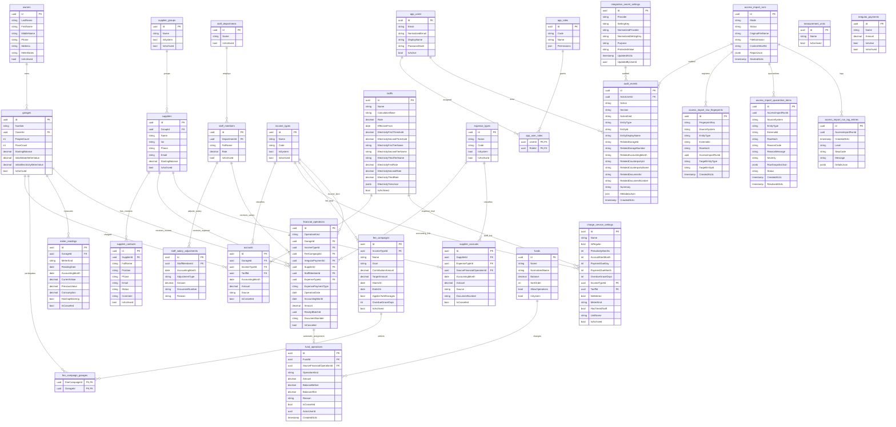

# ERD И Схема Данных

Документ фиксирует текущую PostgreSQL-модель GarageBalance для справочников, финансового учета, импорта, пользователей и audit. Источник правды для схемы - EF Core `GarageBalanceDbContext` и миграции в `backend/GarageBalance.Api/Infrastructure/Data/Migrations`.

## Диаграмма

```mermaid
erDiagram
    owners ||--o{ garages : owns
    supplier_groups ||--o{ suppliers : groups
    suppliers ||--o{ supplier_contacts : has_contacts
    staff_departments ||--o{ staff_members : employs
    staff_members ||--o{ staff_salary_adjustments : adjusts_salary

    garages ||--o{ accruals : charged
    income_types ||--o{ accruals : classifies
    tariffs ||--o{ accruals : calculated_by
    income_types ||--o{ charge_service_settings : accounting_link
    tariffs ||--o{ charge_service_settings : tariff_link
    income_types ||--o{ fee_campaigns : fee_kind
    fee_campaigns ||--o{ fee_campaign_garages : selects
    garages ||--o{ fee_campaign_garages : participates
    garages ||--o{ meter_readings : measures

    garages ||--o{ financial_operations : receives_income
    income_types ||--o{ financial_operations : income_kind
    suppliers ||--o{ financial_operations : receives_expense
    staff_members ||--o{ financial_operations : receives_salary
    expense_types ||--o{ financial_operations : expense_kind

    suppliers ||--o{ supplier_accruals : charged
    expense_types ||--o{ supplier_accruals : classifies

    funds ||--o{ fund_operations : changes
    financial_operations ||--o| fund_operations : automatic_assignment

    app_users ||--o{ app_user_roles : assigned
    app_roles ||--o{ app_user_roles : grants

    app_users ||--o{ audit_events : actor
    access_import_runs ||--o{ audit_events : audited
    access_import_runs ||--o{ access_import_row_fingerprints : registers
    access_import_runs ||--o{ access_import_quarantine_items : quarantines
    access_import_runs ||--o{ access_import_run_log_entries : logs
    integration_secret_settings ||--o{ audit_events : audited

    owners {
        uuid Id PK
        string LastName
        string FirstName
        string MiddleName
        string Phone
        string Address
        string MeterNotes
        bool IsArchived
    }

    garages {
        uuid Id PK
        string Number
        uuid OwnerId FK
        int PeopleCount
        int FloorCount
        decimal StartingBalance
        decimal InitialWaterMeterValue
        decimal InitialElectricityMeterValue
        bool IsArchived
    }

    supplier_groups {
        uuid Id PK
        string Name
        bool IsSystem
        bool IsArchived
    }

    suppliers {
        uuid Id PK
        uuid GroupId FK
        string Name
        string Inn
        string Phone
        string Email
        decimal StartingBalance
        bool IsArchived
    }

    supplier_contacts {
        uuid Id PK
        uuid SupplierId FK
        string FullName
        string Position
        string Phone
        string Email
        string Status
        string Comment
        bool IsArchived
    }

    staff_departments {
        uuid Id PK
        string Name
        bool IsArchived
    }

    staff_members {
        uuid Id PK
        uuid DepartmentId FK
        string FullName
        decimal Rate
        bool IsArchived
    }

    staff_salary_adjustments {
        uuid Id PK
        uuid StaffMemberId FK
        date AccountingMonth
        string AdjustmentType
        decimal Amount
        string DocumentNumber
        string Reason
    }

    income_types {
        uuid Id PK
        string Name
        string Code
        bool IsSystem
        bool IsArchived
    }

    expense_types {
        uuid Id PK
        string Name
        string Code
        bool IsSystem
        bool IsArchived
    }

    tariffs {
        uuid Id PK
        string Name
        string CalculationBase
        decimal Rate
        date EffectiveFrom
        decimal ElectricityFirstThreshold
        decimal ElectricitySecondThreshold
        string ElectricityFirstTierName
        string ElectricitySecondTierName
        string ElectricityThirdTierName
        decimal ElectricityFirstRate
        decimal ElectricitySecondRate
        decimal ElectricityThirdRate
        jsonb ElectricityTiersJson
        bool IsArchived
    }

    measurement_units {
        uuid Id PK
        string Name
        bool IsArchived
    }

    charge_service_settings {
        uuid Id PK
        string Name
        bool IsRegular
        int PeriodicityMonths
        int AccrualStartMonth
        int PaymentDueDay
        int PaymentDueMonth
        int OverdueGraceDays
        uuid IncomeTypeId FK
        uuid TariffId FK
        bool IsMetered
        string MeterKind
        bool HasTieredTariff
        string UnitName
        bool IsArchived
    }

    irregular_payments {
        uuid Id PK
        string Name
        decimal Amount
        bool IsActive
        bool IsArchived
    }

    fee_campaigns {
        uuid Id PK
        uuid IncomeTypeId FK
        string Name
        string Goal
        decimal ContributionAmount
        decimal TargetAmount
        date StartsOn
        date EndsOn
        bool AppliesToAllGarages
        int OverdueGraceDays
        bool IsArchived
    }

    fee_campaign_garages {
        uuid FeeCampaignId PK, FK
        uuid GarageId PK, FK
    }

    accruals {
        uuid Id PK
        uuid GarageId FK
        uuid IncomeTypeId FK
        uuid TariffId FK
        date AccountingMonth
        decimal Amount
        string Source
        bool IsCanceled
    }

    financial_operations {
        uuid Id PK
        string OperationKind
        uuid GarageId FK
        uuid IncomeTypeId FK
        uuid FeeCampaignId FK
        uuid IrregularPaymentId FK
        uuid SupplierId FK
        uuid StaffMemberId FK
        uuid ExpenseTypeId FK
        string ExpensePaymentType
        date OperationDate
        date AccountingMonth
        decimal Amount
        uuid ReceiptBatchId
        string DocumentNumber
        bool IsCanceled
    }

    supplier_accruals {
        uuid Id PK
        uuid SupplierId FK
        uuid ExpenseTypeId FK
        uuid SourceFinancialOperationId FK
        date AccountingMonth
        decimal Amount
        string Source
        string DocumentNumber
        bool IsCanceled
    }

    meter_readings {
        uuid Id PK
        uuid GarageId FK
        string MeterKind
        date ReadingDate
        date AccountingMonth
        decimal CurrentValue
        decimal PreviousValue
        decimal Consumption
        bool HasGapWarning
        bool IsCanceled
    }

    funds {
        uuid Id PK
        string Name
        string NormalizedName
        decimal Balance
        int SortOrder
        bool AllowOperations
        bool IsSystem
    }

    fund_operations {
        uuid Id PK
        uuid FundId FK
        uuid SourceFinancialOperationId FK
        string OperationKind
        decimal Amount
        decimal BalanceBefore
        decimal BalanceAfter
        string Reason
        bool IsCanceled
        uuid ActorUserId
        timestamp CreatedAtUtc
    }

    app_users {
        uuid Id PK
        string Email
        string NormalizedEmail
        string DisplayName
        string PasswordHash
        bool IsActive
    }

    app_roles {
        uuid Id PK
        string Code
        string Name
        json Permissions
    }

    app_user_roles {
        uuid UserId PK,FK
        uuid RoleId PK,FK
    }

    audit_events {
        uuid Id PK
        uuid ActorUserId FK
        string Action
        string Section
        string ActionKind
        string EntityType
        string EntityId
        string EntityDisplayName
        string RelatedGarageId
        string RelatedGarageNumber
        string RelatedAccountingMonth
        string RelatedCounterpartyId
        string RelatedCounterpartyName
        string RelatedDocumentId
        string RelatedDocumentNumber
        string Summary
        json MetadataJson
        timestamp CreatedAtUtc
    }

    access_import_runs {
        uuid Id PK
        string Mode
        string Status
        string OriginalFileName
        string FileExtension
        string ContentSha256
        jsonb ReportJson
        timestamp StartedAtUtc
    }

    access_import_row_fingerprints {
        uuid Id PK
        string FingerprintKey
        string SourceSystem
        string EntityType
        string ExternalId
        string RowHash
        uuid AccessImportRunId
        string TargetEntityType
        string TargetEntityId
        timestamp CreatedAtUtc
    }

    access_import_quarantine_items {
        uuid Id PK
        uuid AccessImportRunId
        string SourceSystem
        string EntityType
        string ExternalId
        string RowHash
        string ReasonCode
        string ReasonMessage
        string Severity
        jsonb RowSnapshotJson
        string Status
        timestamp CreatedAtUtc
        timestamp ResolvedAtUtc
    }

    access_import_run_log_entries {
        uuid Id PK
        uuid AccessImportRunId
        timestamp CreatedAtUtc
        string Level
        string StepCode
        string Message
        jsonb DetailsJson
    }

    integration_secret_settings {
        uuid Id PK
        string Provider
        string SettingKey
        string NormalizedProvider
        string NormalizedSettingKey
        string Purpose
        string ProtectedValue
        timestamp UpdatedAtUtc
        uuid UpdatedByUserId
    }
```

## Справочники

- `owners` - владельцы гаражей. GIN trigram-индексы поддерживают регистронезависимый поиск по частям ФИО, объединённому ФИО и телефону. Архивирование мягкое через `IsArchived`.
- `garages` - гаражи, владелец, стартовый баланс, стартовые счетчики, люди, этажи. Связь `Garage.OwnerId -> owners.Id` с `DeleteBehavior.SetNull`. Активный номер гаража уникален через filtered unique index по `Number` при `IsArchived = false`; отдельный GIN trigram-индекс ускоряет поиск по части номера.
- `supplier_groups` - группы поставщиков. `Name` уникален, системные группы защищены от удаления.
- `suppliers` - поставщики с группой, ИНН, контактами и стартовым балансом. Связь `Supplier.GroupId -> supplier_groups.Id` с `DeleteBehavior.Restrict`; GIN trigram-индексы ускоряют поиск по названию, ИНН, контактному лицу, группе и связанной услуге.
- `supplier_contacts` - контактные лица поставщика: ФИО, должность, телефон, почта, рабочий статус, комментарий и архивность. Связь `SupplierContact.SupplierId -> suppliers.Id` удаляется каскадно вместе с поставщиком; GIN trigram-индексы покрывают ФИО, должность, телефон и почту, а составной частичный индекс ускоряет выбор одного основного действующего контакта.
- `staff_departments` - отделы персонала. Активное название уникально через filtered unique index по `Name` при `IsArchived = false`.
- `staff_members` - сотрудники с отделом и текущей ставкой. Связь `StaffMember.DepartmentId -> staff_departments.Id` использует `DeleteBehavior.Restrict`, чтобы отдел с сотрудниками не исчезал физически; GIN trigram-индексы ускоряют поиск по ФИО сотрудника и названию отдела, обычный индекс покрывает `DepartmentId`.
- `staff_salary_rate_periods` - история месячных ставок сотрудника. `EffectiveFrom` нормализован на первый день месяца, пара `StaffMemberId + EffectiveFrom` уникальна; изменение ставки обновляет либо создаёт период текущего рабочего месяца, не пересчитывая старые месяцы по новой ставке.
- `staff_employment_periods` - интервалы работы сотрудника с точными датами принятия и необязательного увольнения. При расчёте оклада месяц каждой граничной даты входит целиком; окончание не может предшествовать началу, а частичный уникальный индекс допускает только один открытый период сотрудника. Архивирование закрывает период, восстановление открывает новый и не начисляет долг за месяцы перерыва.
- `application_settings` хранит типизированные общесистемные параметры. Nullable `IntegerValue` используется для дня автоматического начисления зарплаты (1–28); изменение выполняется через административный сервис и фиксируется в audit.
- `income_types` и `expense_types` - виды поступлений и статьи расходов. `Name` уникален, `Code` индексируется, системные значения seeded через migration `DefaultAccountingTypes`.
- `tariffs` - тарифы с базой расчета `fixed`, `people`, `meter_water`, `meter_electricity`, ставкой и датой действия. Показание, расход и границы ступеней электроэнергии измеряются в `кВт·ч`. Упорядоченный `ElectricityTiersJson` атомарно хранит от 2 до 20 ступеней электроэнергии: стабильный идентификатор, название, возрастающую верхнюю границу (у последней ступени границы нет), ставку и признак пользовательского порога. Старые три пары полей сохраняются для обратной совместимости существующих данных. Уникальность: `Name + EffectiveFrom`; отдельные и составной partial-индексы покрывают `CalculationBase + EffectiveFrom` для выбора действующего неархивного тарифа по расчётному месяцу.
- `charge_service_settings` - настройки услуг раздела "Тарифы и сборы": регулярность, режим начисления (`PeriodicityMonths = 1` для ежемесячного и `12` для ежегодного), месяц ежегодного начисления, день оплаты, необязательный месяц оплаты для ежегодного режима, перенос долга, единица измерения, признаки счетчика и пороговой тарификации, а также ссылки на `IncomeTypeId` и `TariffId` для генерации начислений владельцам. `MeterKind` является стабильным ключом независимой цепочки показаний услуги; миграция сохраняет исторические ключи `water`/`electricity`, а остальным услугам назначает ключ `service_<Id>`. Nullable-ссылка `ExpenseTypeId -> expense_types.Id` с `DeleteBehavior.Restrict` задаёт единственный допустимый вид начисления поставщику для этой услуги; поставщик ссылается на услугу через `Supplier.ChargeServiceSettingId`, и backend отклоняет начисление по другой паре. Для ежемесячного режима срок рассчитывается в следующем месяце после начисления; для ежегодного — по выбранной календарной дате. Активное имя уникально через filtered unique index по `Name` при `IsArchived = false`; индексы покрывают `IsRegular`, `IsMetered`, `MeterKind`, `HasTieredTariff`, `IncomeTypeId`, `ExpenseTypeId`, `TariffId` и составной активный путь `IsRegular + IsMetered + TariffId`.
- `measurement_units` - редактируемый справочник единиц измерения. Активные названия уникальны без учёта регистра; новое обозначение из формы услуги автоматически добавляется в справочник. Услуга хранит снимок обозначения в `charge_service_settings.UnitName`, а переименование справочной записи одним действием обновляет связанные настройки услуг. Архивирование единицы, используемой действующей услугой, запрещено.
- `irregular_payments` - готовые основания нерегулярных платежей с суммой, активностью и архивностью. Активное имя уникально через filtered unique index по `Name` при `IsArchived = false`; индекс `IsActive` используется для рабочих списков. Разовое начисление хранит снимок выбранного либо произвольного текста в nullable-поле `accruals.Basis`; ссылка `IrregularPaymentId` остаётся только для выбранного готового значения. Целевой платёж хранит ту же nullable-ссылку в `financial_operations.IrregularPaymentId`, поэтому распределитель закрывает только выбранное разовое начисление. Миграция заполняет основание существующих начислений и восстанавливает связь старых однозначно распределённых платежей.
- `fee_campaigns` - объявленные сборы: название, связанный вид поступления, цель, сумма взноса, плановая сумма сбора, период действия, правило участия всех гаражей и срок переноса долга в просроченный. При создании и изменении backend рассчитывает `TargetAmount = ContributionAmount × ParticipantCount`: для общего сбора учитываются все активные гаражи, для выборочного — проверенный список участников. Платёж связывается со сбором через `financial_operations.FeeCampaignId`; сервер под блокировкой ограничивает его общим остатком плана. После частичной оплаты прежние неоплаченные начисления свертываются, следующему гаражу создаётся обязательство `min(ContributionAmount, TargetAmount - CollectedAmount)`, а при достижении плана сбор закрывается автоматически. Активное название уникально через filtered unique index по `Name` при `IsArchived = false`; индексы покрывают `IncomeTypeId`, `StartsOn`, `IsArchived` и связь целевых платежей.
- `fee_campaign_garages` - выбранные участники объявленного сбора, когда сбор действует не для всех гаражей. Состав участников хранится как составной ключ `FeeCampaignId + GarageId`, удаляется каскадно вместе со сбором и используется при массовом начислении вместо полного списка активных гаражей.

## Финансы

- `accruals` - начисления владельцам по гаражу, виду поступления, тарифу и учетному месяцу. Для регулярного начисления `CalculationDetailsJson` хранит неизменяемый JSONB-снимок всех календарных участков месяца: базы расчёта, ставки, пороги, показания, распределённый объём, формулу и сумму. `RequiresMeterReading` и `CalculationMeterKind` позволяют адресно перестраивать связанные начисления после изменения цепочки показаний, включая месяцы со сменой фиксированного и счётчикового режима. Старые начисления без снимка поддерживаются через прежнюю ссылку `TariffId`. Уникальность активных строк: `GarageId + IncomeTypeId + AccountingMonth + Source`; индексы покрывают `AccountingMonth`, `GarageId`, `IncomeTypeId`, `TariffId` и поиск счётчиковых снимков по гаражу и месяцу.
- `financial_operations` - фактические поступления и выплаты. `OperationKind` разделяет `income` и `expense`; поступления связаны с `Garage`/`IncomeType`, выплаты - с `Supplier` или `StaffMember` и статьёй расхода `ExpenseType`. Для выплаты поставщику `ExpensePaymentType` независимо хранит наличие подтверждающего документа (`with_receipt`/`without_receipt`), а `ExpensePaymentSource` — источник денег (`bank`/`cash`). Регулярная банковская выплата обязана использовать статью и фонд услуги поставщика; эпизодическая кассовая выплата допускает выбранные оператором статью и фонд. `Version` является PostgreSQL concurrency-token и не позволяет устаревшей форме молча перезаписать или сторнировать уже изменённую выплату. Nullable `ReceiptBatchId` объединяет строки, созданные одной полной оплатой, для единой квитанции; идентификатор может повторяться только в пределах одного гаража и одной даты операции, а отменённые строки не печатаются. Индексы покрывают дату операции, учётный месяц, тип операции, документ, пакет квитанции, гараж, поставщика, сотрудника, тип и источник выплаты; отдельные partial-индексы ускоряют активную страницу по виду/дате и FIFO-ledger по точной паре гараж/вид поступления.
- `staff_salary_adjustments` - отдельные премии и штрафы сотрудников поверх автоматического месячного оклада. `AdjustmentType` ограничен значениями `bonus` и `penalty`, сумма положительна на уровне бизнес-правил, а основание обязательно. Штраф не может уменьшить начисление ниже уже выплаченной суммы. Отмена хранит причину и время, а `Version` обеспечивает оптимистичный контроль параллельного изменения, отмены и восстановления. Связь со `staff_members` защищена `DeleteBehavior.Restrict`; индексы покрывают месяц, сотрудника и сочетание `StaffMemberId + AccountingMonth + AdjustmentType`.
- `supplier_accruals` - начисления поставщикам по поставщику, статье расхода и учётному месяцу. Для регулярного сценария `ExpenseTypeId` обязан совпадать с `Supplier.ChargeServiceSetting.ExpenseTypeId`; эпизодическая кассовая выплата атомарно создаёт начисление стоимости по выбранной статье и фонду с уникальной nullable-ссылкой `SourceFinancialOperationId`. Наличие чека не меняет источник денег и не влияет на атомарность. Изменение, отмена и восстановление выплаты синхронно изменяют связанную строку. Уникальность: `SupplierId + ExpenseTypeId + AccountingMonth + Source + DocumentNumber`.
- `meter_devices` - физические счетчики гаража по каждой счётчиковой услуге: серийный номер, дата установки/снятия, начальное и конечное показания. Partial unique-индекс допускает только один действующий прибор каждого типа на гараж, а составной уникальный индекс не позволяет повторно зарегистрировать тот же номер для этого гаража и типа.
- `meter_readings` - показания любой регулярной услуги с режимом «По счётчику»; `MeterKind` связывает строку со стабильным ключом услуги. Nullable-ссылка `MeterDeviceId -> meter_devices.Id` связывает строку с физическим прибором. Для переходного месяца `PreviousDeviceConsumption` хранит расход снятого прибора, а `IsMeterReplacement` защищает оформленную замену от отдельной отмены; итоговый `Consumption` включает расход старого и нового счетчиков. Partial unique-индекс `GarageId + MeterKind + AccountingMonth` запрещает два активных показания за один месяц, а partial-индекс `MeterKind + AccountingMonth + GarageId` обслуживает годовые страницы и поиск отсутствующих показаний без чтения отменённых строк. `HasGapWarning` фиксирует разрыв истории.
- `funds` - фонды учета с нормализованным именем, фактическим распределенным балансом, порядком сортировки и флагами системности/разрешенных операций. `NormalizedName` уникален, `SortOrder` индексируется. Каждое поступление с действующим назначением сразу увеличивает баланс соответствующего фонда; в общем нераспределённом пуле остаются только суммы без назначения и возвращённые остатки удалённых фондов.
- `cash_bank_transfers` - самостоятельные переводы наличных из кассы на банковский счёт. Таблица хранит бизнес-дату перевода, сумму, комментарий, признак отмены, пользователя-инициатора и технические даты; перевод уменьшает кассу и увеличивает банк на одну сумму, но не меняет ни один фонд.
- `cash_bank_balance_operations` - неизменяемые операции стартового остатка и отдельных корректировок кассы/банковского счёта. `Account` ограничен значениями `cash`/`bank`, `OperationKind` — `opening_balance`/`adjustment`, `Direction` — `increase`/`decrease`, сумма всегда положительна. Таблица хранит бизнес-дату, обязательную причину, пользователя и время создания; текущий физический остаток рассчитывается как поступления и переводы с учётом знакового итога этих операций. Индексы покрывают дату, время создания, пользователя и сочетание счёта с видом операции.
- `fund_operations` - операции пополнения, изъятия и распределения фонда. Nullable-ссылка `SourceFinancialOperationId` связывает автоматическую операцию с единственной исходной финансовой записью; частичный уникальный индекс запрещает вторую связь. Автоматическое назначение поступления (`deposit`) сразу увеличивает остаток выбранного фонда, автоматическое списание банковской выплаты (`withdraw`) уменьшает его, а ручные операции без `SourceFinancialOperationId` переводят суммы между общим пулом и фондом. Кассовые выплаты поставщикам и сотрудникам фонд не затрагивают. Таблица хранит сумму, баланс до/после, обязательную причину, признак отмены и пользователя-инициатора. Составной индекс `FundId + CreatedAtUtc + Id` позволяет при историческом изменении пересчитать только затронутую операцию и последующий хронологический хвост.

Начисления считаются по `AccountingMonth`, фактические поступления и выплаты - по `OperationDate`, а отчеты дополнительно показывают учетный месяц для сверки.

## Пользователи И Права

- `app_users` - пользователи системы, email уникален через `NormalizedEmail`.
- `app_roles` - роли с JSON-списком permissions. `Code` уникален.
- `app_user_roles` - many-to-many между пользователями и ролями, составной ключ `UserId + RoleId`.

Рабочие endpoints закрываются permission policies; публичными остаются только bootstrap, login и health.

## История Изменений И Импорт

- `audit_events` - единая история изменений. Помимо `Action`, `EntityType`, `EntityId` и `Summary`, хранит структурированные поля `Section`, `ActionKind`, `EntityDisplayName`, связанные гараж/месяц/контрагент/документ и безопасный `MetadataJson`. Индексы: `CreatedAtUtc`, `ActorUserId`, `Section`, `ActionKind`, `EntityType + EntityId`, `Section + ActionKind + CreatedAtUtc`, связанные гараж/номер гаража/месяц/контрагент/документ. События не должны раскрывать пароли, токены, `.env`, дампы и персональные финансовые выгрузки.
- `access_import_runs` - наблюдаемая очередь, dry-run и будущие запуски импорта Access. Индексы: `StartedAtUtc`, `Status`, `ContentSha256`, `Status + StartedAtUtc`, `ContentSha256 + StartedAtUtc`. Полный отчет хранится в `ReportJson` как `jsonb`.
- `access_import_row_fingerprints` - реестр идемпотентности будущего переноса Access. `FingerprintKey` уникален и строится из `SourceSystem + EntityType + ExternalId`, а если внешнего id нет - из `SourceSystem + EntityType + RowHash`. Индексы: `FingerprintKey`, `SourceSystem + EntityType`, `AccessImportRunId`.
- `access_import_quarantine_items` - карантин строк Access, которые нельзя перенести автоматически. Хранит `ReasonCode`, `ReasonMessage`, `Severity`, безопасный статус разбора и `RowSnapshotJson` в `jsonb`; публичные DTO не возвращают raw snapshot. Индексы: `AccessImportRunId`, `Status`, `CreatedAtUtc`, `SourceSystem + EntityType`, `RowHash`.
- `access_import_run_log_entries` - пошаговый лог dry-run и будущего переноса Access. Хранит безопасные для показа `Level`, `StepCode`, `Message` и служебный `DetailsJson` в `jsonb`; публичные DTO не возвращают details. Индексы: `AccessImportRunId`, `CreatedAtUtc`, `AccessImportRunId + CreatedAtUtc`.
- `integration_secret_settings` - зашифрованные секреты будущих интеграций 1C Fresh, фискального оборудования и похожих адаптеров. `ProtectedValue` хранится только в формате `gb:protected:v1:...`, `Purpose` разделяет секреты по назначению, уникальность задается через `NormalizedProvider + NormalizedSettingKey`, индексы покрывают `Provider` и `UpdatedAtUtc`.

## Правила Расширения Схемы

1. Любое изменение схемы идет через EF Core migration.
2. Новые связи должны явно указывать `DeleteBehavior`.
3. Для пользовательского удаления использовать soft-archive или cancel-флаги с причиной и audit-событием.
4. Финансовые суммы хранить в `decimal` с precision, а даты периода нормализовать до первого числа месяца.
5. Новые отчеты должны опираться на индексируемые поля и PostgreSQL aggregation.
6. После изменения схемы обязательно обновить этот документ, пользовательское описание в «Что нового» и idempotent migration script.
